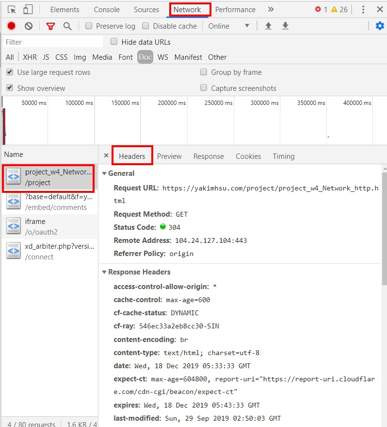

# HTTP

[網路基礎 - HTTP、Request、Response](https://yakimhsu.com/project/project_w4_Network_http.html)

[HTTP Header & Status Code 心得](https://ithelp.ithome.com.tw/articles/10212102)

> HTTP 就是一套網路傳輸協定

## 為何需要了解?

* 前後端經常合作，必須聽懂他們的語言
* 釐清責任歸屬
* 了解瀏覽器運作原理

## HTTP 狀態碼

200 OK 用於請求成功。 GET 檔案成功，PUT， PATCH 更新成功

201 Created 用於請求 POST 成功建立資料。

204 No Content 用於請求 DELETE 成功。

400 Bad Request 用於請求 API 參數不正確的情況，例如傳入的 JSON 格式錯誤。

401 Unauthorized 用於表示請求的 API 缺少身份驗證資訊。

403 Forbidden 用於表示該資源不允許特定用戶訪問。

404 Not Found 用於表示請求一個不存在的資源。

## HTTPS

* SSL 加密
* 簡單來說就是用加密演算法以混淆輸送中的資料，防止駭客資料在連線發送時被攔截破解。
* 什麼是 [SSL、TLS 以及 HTTPS](https://github.com/milankarei1111/laravel_gitbook/tree/da5a1edaab4b78d0c1c6707930312ff6b6aa816d/internet/https%20%20:%20%20/www.websecurity.digicert.com/zh/tw/security-topics/what-is-ssl-tls-https/README.md)？

## Client & Server

> 傳輸資料的兩端會分為 客戶端 \( Client \) 跟 伺服器端 \( Server \)
>
> * Client： 以網頁來說就是你的瀏覽器、電腦，主要會發送 「 請求 request 」到 Server 端
> * Server： 收到 request 開始處理資料，完成後會回傳 「回應 response 」到 Client 端



## 如何查看 Header

* Chrome 瀏覽器的開發人員工具 / Network Tab 重新整理網頁，就可以看到 resquest 跟回傳的 response 詳細資訊。
* 每個請求有 Headers / Preview / Response 可查看
  * Preview 會以瀏覽器能解析的方式呈現
  * Response 則將內容以純文字呈現
  * Headers view source 可看更多細節
* Header 種類
  * Request Header : 客戶端要求伺服器時傳送
  * Response  Header : 伺服器回應客戶端時傳送
  * 有發送請求，就必會有回應 \(只要伺服器正常運作\)

## 共通Header 設定

* Request & Response Header 共通 Header 設定
* Request Method : http方法 GET/POST
* Status Code : 狀態碼 200
* Upgrade : 升級到另外一個協定 \(Ex : websocket\)
* Content-Type : 指傳送內容的格式 \(常見格式如下\)

  ```php
    // 一般表單欄位
    application/x-www-form-urlencoded 
    // 檔案上傳
    multipart/form-data; boundary=--xxx 
    // JSON資料
    application/json 
    // 純文字
    text/plain
  ```

* Content-Encoding  : 內容壓縮格式 \(通常為 gzip\)
* Content-length : 傳送內容大小 \(可用於計算下載耗時/進度\)

### Request Header

* Request URL : 請求資源的位置
* Host : 瀏覽器存取的 Host 名稱 \(不可省\)

  > 因為一個IP可以綁定多個 Domain，必須知道要對應的伺服器。

* User-Agent : 瀏覽器名版本 & 作業系統名版本
* Connection : keep-alive \(保持連線不斷掉\)

  > 建立&關閉連線相當耗時，保持連線，減少重新連接TCP次數，可以有效提高傳輸效率。

* If-Modified-Since : 快取時間 \(用來判斷是否要更新內容\)
* Cookie \(每次請求都會發送瀏覽器的cookie，下詳\)
* Authorization HTTP連線的身分驗證
* Referer : 紀錄瀏覽器前一個頁面的網址

  > 可用於行銷，來判斷從哪裡點入的 \(不可靠，可被串改\)

* Accept 類可用 q=0.5 來配置優先取得的權重
  * Accept : text/html \(能接受檔案類型\)
  * Accept-Language : zh-TW \(能接受的語言\)
  * Accept-Encoding : gzip \(能支援的壓縮格式\)

    **Response Header**
* Etag : 產生檔案的 Hash Code，紀錄檔案是否變更
* Last-Modified : 回傳檔案修改的時間 \(原理同 If-None-Match\)
* Catch-Control : 快取檔案的策略
  * max-age 設定該檔案有效的快取秒數，過期則要求新的
  * no-cache 不使用快取
* Location : 當狀態碼是301或302時，瀏覽器重新導向的目標位置
* Content-Disposiiotn : 讓瀏覽器可以打開下載視窗並且指定檔案名稱

  > Content-Disposiiotn : attachment; filename="test.zip"

* X-Frame-Options 可以避免自己的網頁被放在別人的iframe裏面 \(需同網域才可放\)
* Access-Control-Allow-Origin \(允許跨域存取的網域名稱\)

  > 全部的網域使用 \* 代表script & link 不再此限 \(因此JSON可實現跨域存取\)

## WebSocket \(雙向溝通\)

> 瀏覽器與伺服器交換資料的方式之一
>
> 與HTTP最大的不同是，他是一個持續的雙向的連線，所以沒有重新連線，重新傳送檔頭等多餘的負荷，反應更即時。
>
> 分成兩個部分，一個是瀏覽器上的程式介面，另外一個是伺服器端的傳輸協定標準
>
> * Header 傳送 Upgrade : websocket
> * 伺服器回應 101 切換協定
> * 建立一個保持連線的狀態，連線會更即時、更快速
> * 建立雙向的通道，可任意的作資料傳遞，即不需要送一個 request 即回一個 response，可一直丟
> * 伺服器能承受的連線數量要很高，通常會作負載平衡\(load balance\)

