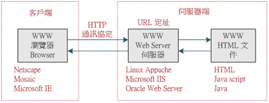
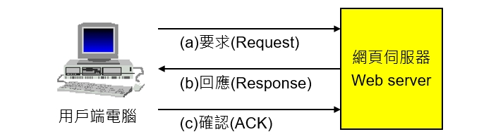

# Web Server

[網頁伺服器（Web Server）是什麼?](https://www.newscan.com.tw/all-knowledge/knowledge-detail-6.htm)

[Web 伺服器是什麼？如何運用？](https://www.stockfeel.com.tw/web-%E4%BC%BA%E6%9C%8D%E5%99%A8%E6%98%AF%E4%BB%80%E9%BA%BC%EF%BC%9F%E5%A6%82%E4%BD%95%E9%81%8B%E7%94%A8%EF%BC%9F/)

[網頁伺服器 - httpd](http://www.tsnien.idv.tw/Linux_WebBook/chap9/9-4%20%E7%B6%B2%E9%A0%81%E4%BC%BA%E6%9C%8D%E5%99%A8.html)

## 網頁伺服器是什麼?

* 包含幾個硬體和軟體層面:
  1. 一台提供服務的電腦
  2. 一台負責提供網頁的電腦，主要是HTML檔案，透過HTTP協定傳給客戶端（一般是指網頁瀏覽器）。
  3. 一個提供網頁的伺服器程式。
* 每一台網頁伺服器（第2個意思）會執行最少一個網頁伺服器程式（第3個意思）。

## 網頁伺服器的運作

每一個網頁伺服器程式從網路接受HTTP請求，然後提供HTTP回應給請求者。 HTTP回應一般包含一個HTML檔案，但也可以包含一個純文字檔案、一個圖像或其他類型的檔案。

舉例:

當我們在網址列輸入「[https://www.google.com/」：](https://www.google.com/」：) 使用 HTTP 通訊協定以網頁瀏覽器和 [https://www.google.com/](https://www.google.com/) 這台網頁伺服器進行通訊， 一般的網頁內容包含一個 HTML 檔案，以及文字、圖形、影片的連結檔。

網址\(url\)組合: &lt;協定&gt;://&lt;主機位址或主機名稱&gt;\[:port\]/&lt;目錄資源&gt;

## 網頁伺服器的種類

* Apache軟體基金會 -Apache HTTP伺服器
* Microsoft - Internet Information Server（IIS）
* Google - Google Web Server
* nginx公司 - nginx
* lighttpd公司 - lighttpd

## 網頁伺服器的攻擊

例如：怪客先寫好一個簡單的軟體，由用戶端電腦向 Google 的網頁伺服器發出「要求（Request）」連線的封包， 這個時候 Google 的網頁伺服器會開啟一個程式（Process）來處理這個連線要求，並且「回應（Response）」同意連線的封包。

此時用戶端電腦故意不回覆「確認（ACK）」的封包，並且再發出第二個「要求（Request）」連線的封包， 依此類推，不停地發出成千上萬個要求連線（Request）的封包，Google 的網頁伺服器就會打開成千上萬個程式（Process）， 卻一直等不到用戶端電腦回應（Response）同意連線的封包， 不停開啟成千上萬個程式（Process）直到伺服器不堪負荷當機為止，網頁伺服器就掛囉！

> 解決方式:
>
> 網頁伺服器都會設定一個等待時間，如果收到某一台用戶端電腦發出要求（Request）連線的封包，
>
> 經過一段時間卻沒有收到確認（ACK）的封包，網頁伺服器就會自動將這個程式（Process）關閉，
>
> 以避免打開過多的程式（Process）而當機。

## 伺服器端的軟體:Apache

* 是公開原始程式碼
* 目前世界上架設網站使用最多的伺服器軟體
* 可以跨平台安裝，例如：Unix、Linux、OS2、Windows

