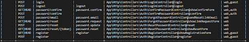

# 身分驗證

## 流程

* 路由 Auth::routes\(\);

  > \(底層:vendor\laravel\framework\src\Illuminate\Routing\Router.php\) 

* 身份驗證控制器，每一個都使用一個特性來包含它們的必要方法:

  ```php
  // App\Http\Controllers\Auth
  RegisterController            處理新的用戶註冊，
  LoginController                處理身份驗證，
  ForgotPasswordController    處理用於重置密碼的電子郵件鏈接，
  ResetPasswordController        包含重置密碼的邏輯。
  ```

* 登入驗證成功畫面 HomeController@index 方法 =&gt; return view\('home'\);

## 使用

[影片:web認證](https://www.bilibili.com/video/av74879198?p=2)

[laravel 5.7 源碼分析](https://mileschou.github.io/ironman/analyze-laravel)

[laravel 5.4源碼分析](https://leoyang90.gitbooks.io/laravel-source-analysis/content/)

[php原生學習](https://kejyuntw.gitbooks.io/php-learning-notes/content/)

### Auth鷹架產生的功能

1. route : 新增了兩行語法:在路由檔註冊登入、登出、首頁、忘記密碼的路由

   ```php
   // routes/web.php
   Auth::routes();
   Route::get('/home', 'HomeController@index')->name('home');
   ```

   

   > 若不需要註冊,可改成:
   >
   > ```php
   > Auth::routes(['register' => false]);
   > ```

2. controller : 新增HomeController.php
3. view : 新增登入、登出和首頁視圖 採用Bootstrap CSS 框架

   ```text
   resources/views/auth
   resources/views/layout
   home.blade.php
   ```

4. 資料庫 : 預設的User Eloquent、migration, .env 文件需配置資料庫

### 安裝後自定義

參考webAuth範例 [影片講解05:40](https://www.bilibili.com/video/av74879198?p=1)

> 自定義驗證成功後跳轉頁面 方法優先於屬性

當使用者成功通過認證，他們將會重導至 /home 這個 URl。

* 修改以下這些 控制器 中的 redirectTo 屬性來重新選擇位置

  ```php
    // LoginController.php
    // RegisterController.php
    // ResetPasswordController.php
    // ConfirmPasswordController.php

    protected $redirectTo = '/home';
  ```

* 控制器加入自定義 redirectTo 方法

  ```php
    Route::get('/test', function(){
    return time();
    });

    // 控制器測試
    class LoginController extends Controller
    {
    protected function redirectTo()
        {
            return '/test'; // 重新定向至/test 頁面
        }
    }
  ```

* 編輯中間件: RedirectIfAuthenticated 的 handle\(\) 來使用新的重定向URI

> 自定義 **未認證** 跳轉頁面改變屬性或是透過方法
>
> * 通過更新app/Http/Middleware/Authenticate.php文件中的 redirectTo 函數來改變行為
>
> 自定義Guard\(守衛\) 1. 在以下控制器中定義 guard\(\)。這個方法會回傳一個「守衛」實例

```php
    // LoginController.php
    // RegisterController.php
    // ResetPasswordController.php

    use Illuminate\Support\Facades\Auth;
    protected function guard()
    {
        return Auth::guard('guard-name');
    }
```

1. 「guard」名稱需要在配置文件config/auth.php中配置過

> 自定義驗證/存儲\(註冊表單內容\)

* 要修改使用者註冊時所需填寫的表單欄位，或是自訂如何將使用者的記錄新增到資料庫的方式，修改 

  \`\`\`text

  RegisterController 這個類別。這個類別負責驗證與建立新的使用者。

validator\(\) :新使用者的驗證規則，你可以根據你的需求來自由的修改這些方法

create \(\)負責使用 Eloquent ORM 負責在你的資料庫建立新的 App\User 記錄

```text
>取得 **已認證** 用戶資訊 通過 Auth facade(門面)訪問認證用戶 
```php
use Illuminate\Support\Facades\Auth; 
$user = Auth::user(); // 取得目前已驗證的使用者...
$id = Auth::id(); // 取得目前已認證的使用者 ID …
```

* 判斷當前用戶是否通過認證

為了確定使用者是否已經登入你的應用程式，可使用 check \(\)，如果使用者已經被認證，將回傳 true

```php
    if (Auth::check()) {
    // 使用者已經登入...
    }
```

* 或是透過 Illuminate\Http\Request 實例存取已認證的使用者

  ```php
  Route::get('/test', function(){
  dump(Auth::user()); // 取得已認證用戶實例
  dump(Auth::id()); // 取得已認證用戶id
  dump(Auth::check()); // 判斷當前用戶是否通過認證
  return time();
  });
  ```

  ```php
  <?php
  namespace App\Http\Controllers;
  use Illuminate\Http\Request; // 型別提示的類別將會自動注入到你的控制器方法中：
  public function update(Request $request)
  {
    request->user() // 回傳已認證的使用者實例...
  }
  ```

  

* 通常的做法是:在用戶訪問特定路由/控制器之前使用middleware\(\)中間件來驗證用戶是否通過認證
  * 路由保護 允許已認證的使用者存取指定的路由

    ```php
    // 透過中間件方法 middleware('auth') 來要求需登入才可訪問該auth頁面
    Route::get('/auth', function(){
      return 'auth頁面';
    })->middleware('auth');
    ```

  * 控制器保護:可以在建構子呼叫 middleware 這方法，而不用在路由中定義它：

    ```php
    // 控制器保護範例:
    Route::get('/student', 'StudentContrller@index');

    class StudentController extends Controller
    {
      public function __construct()
      {
          // $this->middleware('guest'); // 不需認證
          $this->middleware('auth');  // 需認證
      }
      public function index()
      {
          return '訪問學生頁面';
      }
    }
    ```

    > Illuminate\Foundation\Auth 相關特徵 AuthenticatesUsers

> 登出 Auth::logout\(\);

* 認證限制  ex:登錄失敗次數限制
* 如果使用 Laravel 內建的 LoginController 類別， Illuminate\Foundation\Auth\ThrottlesLogins trait 已放入控制器中。預設情況下，使用者如果嘗試登入多次都無法成功，那麼使用者在一分鐘內無法再進行登入，限制根據使用者的名稱、email 和 IP 位置。

> 自訂註冊頁面

* RegisterController 使用RegistersUsers特徵 若要自訂註冊頁面可以覆寫showRegistrationForm\(\)方法

  \`\`\`php

  class RegisterController extends Controller

  {

   use RegistersUsers;

  }

  class LoginController extends Controller

  {

  ```text
  use AuthenticatesUsers;
  ```

  }

```text
## 實作
[Laravel Auth](https://ithelp.ithome.com.tw/articles/10221845)

### 安裝
> 通過Composer 安裝 laravel/ui擴展包
>
> Laravel的laravel/ui包提供了一種快速方法，可以使用一些簡單的命令來支持你
進行身份驗證所需的所有路由和視圖

```bath
composer require laravel/ui
```


> 初始化前端腳手架代碼\(生成用戶認證需要的所有路由和視圖\)
>
> 創建驗證所需的所有視圖，並將它們放在resources/views/auth目錄下。

```text
php artisan ui vue --auth
```


> 安裝前端依賴並編譯前端資源
>
> ```text
> npm install && npm run dev
> ```
>
> 
>
> 註冊一個新的帳密後即可登入   

