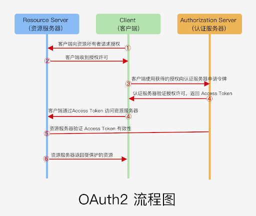
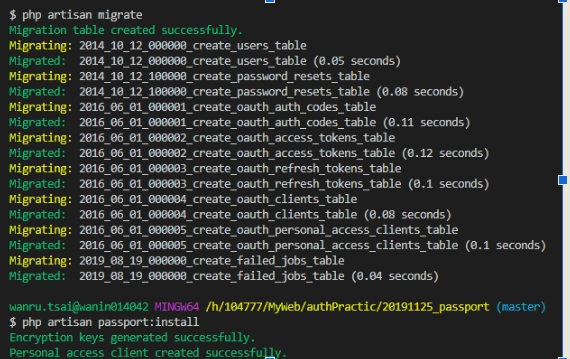
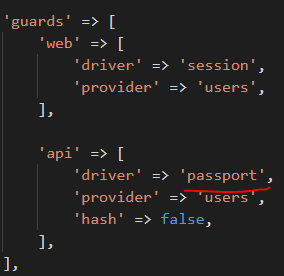
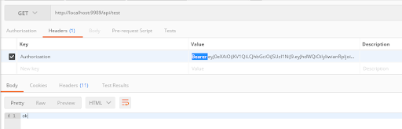

# OAuth 2.0認證

[影片:彻底理解 OAuth2 协议](https://www.youtube.com/watch?v=T0h6A-M_WmI)

[簡報內容](https://slides.com/biezhi/oauth2#/)

[OAuth 2.0 筆記 \(1\) 世界觀](https://blog.yorkxin.org/2013/09/30/oauth2-1-introduction.html)

[理解OAuth 2.0 \(阮一峰\)](https://www.ruanyifeng.com/blog/2014/05/oauth_2_0.html)

[OAuth2介紹與使用](https://kknews.cc/tech/z8ekg53.html)

## 簡介

> OAuth 2.0授權支持第三方應用程序，以獲取對HTTP服務的有限訪問權。
>
> 身分認證基於對請求方的不信任所產生的，是為了解決身分可信任的問題

1. 用戶\(我自己\)
2. 服務提供者\(Github\)
3. 客戶端/第三方應用程序\(laravel平台\)

## 名詞定義

OAuth引入一個認證層 \(authorization layer\) ，並且把 client 跟 resource owner 的角色分開。 Client 會先索取存取權，來存取 Resource Owner 擁有的資源，這些資源會放在 Resource Server 上面，並且 Client 會得到一組不同於 Resource Owner 所持有的認證碼 \(credentials\)

1. Third-party application：第三方應用程式，本文中又稱"客戶端"（client），比如打開知乎，使用第三方登錄，選擇qq登錄，這時候知乎就是客戶端。
2. HTTP service：HTTP服務提供商，本文中簡稱"服務提供商"，即上例的qq。
3. Resource Owner：資源所有者，本文中又稱"用戶"（user）,即登錄用戶。
4. User Agent：用戶代理，本文中就是指瀏覽器。
5. Authorization server：認證伺服器，即服務提供商專門用來處理認證的伺服器。
6. Resource server：資源伺服器，即服務提供商存放用戶生成的資源的伺服器。它與認證伺服器，可以是同一台伺服器，也可以是不同的伺服器。


* 用戶打開客戶端以後，客戶端要求用戶給予授權。
* 用戶同意給予客戶端授權。
* 客戶端使用上一步獲得的授權，向認證伺服器申請令牌。
* 認證伺服器對客戶端進行認證以後，確認無誤，同意發放令牌。
* 客戶端使用令牌，向資源伺服器申請獲取資源。
* 資源伺服器確認令牌無誤，同意向客戶端開放資源。

## 協議角色和流程

1. 資源所有者\(Resource Owner\)          Github使用者
2. 客戶端/第三方應用程序\(Client\)        RubyChina
3. 資源服務器\(Resource Server\)         Github
4. 授權服務器\(Authorization Server\)    Github提供授權

> 資源服務器和授權服務器可放在一起,但嚴格來說角色是分開

## OAuth授權需要資訊

```text
Application name 應用名稱 
Homepage URL     網站地址
Authorization callback URL 回調地址
Clietn_ID
Clietn_Secret
```

## OAuth 流程



## OAuth授權方式

1. 授權碼模式\(authorization code\)
   * 正統的OAuth認證，推薦

     | 字段 | 描述 |
     | :--- | :--- |
     | response\_type | \(必填\)固定為code，表示這是一個授權碼請求。 |
     | client\_id | \(必填\)在授權服務器註冊應用後，得到的唯一辨識。 |
     | redirect\_uri | \(選填\)通過客戶端註冊的重定向URI\(一般要求與註冊時一致\) |
     | scope | \(選填\)請求資源範圍，多個空格隔開 |
     | state | \(選填\)如果存在原樣回傳給客戶端。 |
2. 簡化模式\(implicit grant\)
   * Github在 Redirection URI 回傳 Access Token，網址上回傳參數token=xxxx
   * 為web瀏覽器設計
   * 因將token回傳在網址上，容易受安全攻擊
3. 密碼模式\(Resource Owner Password Credentials Grant\)
   * 用戶向客戶端提供Github帳號密碼，正確後回傳Access Token
   * 為遺留項目設計
4. 客戶端模式\(Client Credentials Grant\)
   * 為後台API服務消費者設計

## 實作

[API 认证解决方案：Laravel Passport](https://xueyuanjun.com/post/19989.html) [通過Passport 實現API 請求認證：令牌作用域詳解](https://xueyuanjun.com/post/9762)

### 密碼模式

[影片: Laravel Passport 密码模式 - 1](https://www.bilibili.com/video/av74879198?p=5) [影片: Laravel Passport 密码模式 - 2](https://www.bilibili.com/video/av74879198?p=6)

> 實作專案名稱 authPractice 資料夾下 20191125\_passport

#### 準備工作

* .env 資料庫配置
* 修改資料庫默認字串長度,因應後面套件包產生的表名長度會過長

**AppServiceProvider 的 boot\(\) 加入 Schema::defaultStringLength\(191\);**

```php
public function boot()
{
    Schema::defaultStringLength(191);
}
```

* 生成BaseRequest

  ```text
  php artisan make:request BaseRequest
  ```

* index.php 替換原生Request 為 BaseRequest \(使得request和reponse都是json格式\) 
* 新增控制器

  ```text
  php artisan make:controller PassportController
  ```

* 安裝 laravel/passport 依賴

  ```text
  composer require laravel/passport
  ```

* 創建表來儲存客戶端和 access\_token

  ```text
  php artisan migrate
  ```

* 生成加密 access\_token的key、Personal access client 個人訪問客戶端, Password grant client 密碼授權客戶端\(這節重點\)

  ```text
  php artisan passport:install
  ```

  

* Laravel\Passport\HasApiTokens Trait  將此特徵引入App\User模型中  \( 提供輔助函數檢查已認證用戶令牌和使用範圍\)


#### 安裝偽造http請求依賴包

```text
composer require guzzlehttp/guzzle
```

#### config/auth.php 配置passport認證



```php
// 視狀況調整
'defaults' => [
    'guard' => 'api'
 ]
```

#### 配置路由

```php
// 安裝laravel/作用:發送令牌
Route::post('/oauth/token', '\Laravel\Passport\Http\Controllers\AccessTokenController@issueToken');

Route::post('/register', 'PassportController@register');
Route::post('/login', 'PassportController@login');
Route::post('/logout', 'PassportController@logout');
Route::post('/refresh', 'PassportController@refresh');

// 授權後才可訪問的測試頁面
Route::get('/test', function(){
    return 'ok';
})->middleware('auth');
```

#### 加入控制器功能\(註冊、登入、登出、刷新\)

> 認證流程 1. 第三方\(例如:嗶哩嗶哩\)使用用戶給的登錄帳密直接和授權服務器\(例如:微信\)索取令牌 2. 授權服務器提供令牌
>
> 使用 access\_token 來請求 test頁面
>
> ```text
> // postman呼叫
> 使用Get方法 在Header
> Key => Authorization
> Value => Bearer+空格+ access_token值
> ```
>
> 


當access\_token過期之後可以使用refrash\_token來取得令牌


#### 使用Scope

> AppServiceProvider 註冊scope
>
> ```php
> public function register()
> {
>     Passport::tokensCan([
>         'test1' => 'for test1',
>         'test2' => 'for test2',
>     ]);
> }
> ```
>
> $routeMiddleware 註冊中間件
>
> ```php
> protected $routeMiddleware = [
>     'scopes' => \Laravel\Passport\Http\Middleware\CheckScopes::class, // and
>     'scope' => \Laravel\Passport\Http\Middleware\CheckForAnyScope::class, // or
> ];
> ```
>
> 設置scope範圍
>
> 全部授權 'scope' =&gt; '\*' ， 授權test1 'scope' =&gt; 'test1'
>
> ```php
> private function getToken()
> {
>     $response = (new Client())->post('http://localhost:9989/api/oauth/token', [
>         'form_params' => [
>             'grant_type' => 'password',
>             'username' => request('email'),
>             'password' => request('password'),
>             'client_id' => $this->clientId,
>             'client_secret' => $this->clientSecret,
>             // 'scope' => '*',
>             'scope' => 'test1',
>         ]
>     ]);
>     return $response->getBody();
> }
> ```
>
> 使用scope設定授權範圍

```php
// Scope用法:透過中間件授權
Route::get('/page1’, function(){
   return 'ok';
// })->middleware('auth'); // 授權全部範圍
// })->middleware('scopes:test1'); // 授權範圍 test1
// })->middleware('scopes:test2'); // 授權範圍 test2
// })->middleware('scopes:test1, test2'); // 必須授權 test1 和 test2
})->middleware('scope:test1, test2'); // 授權範圍 test1 或 test2

// Scope用法:非透過中間件方式
Route::get('/page2', function(){
    // tokenCan(‘授權範圍’)
    if(auth()->user()->tokenCan('test2')) {
        return '授權 通過';
    } else {
        return '授權 失敗';
    }
})->middleware('auth');
```

### 授權碼模式

[影片: Laravel Passport 授权码模式 - 1](https://www.bilibili.com/video/av74879198?p=7) [影片: Laravel Passport 授权码模式 - 2](https://www.bilibili.com/video/av74879198?p=8)

舉例說明: 1. 「嗶哩嗶哩」提供"微信登陸"連結，用戶點擊跳轉到"微信授權服務器" 2. 用戶根據"微信授權服務器"提示登入微信並確認授權給「嗶哩嗶哩」 3. "微信授權服務器"返回瀏覽器\(用戶代理\)1個授權碼 4. 瀏覽器\(用戶代理\)把授權碼傳給「嗶哩嗶哩」 5. 「嗶哩嗶哩」使用授權碼向服務器請求令牌 6. "微信授權服務器" 發送令牌給「嗶哩嗶哩」

> 實作:服務器端\(微信 ex:lisan.com

#### 準備工作

1. 建立專案
2. .env 資料庫配置 \*如果你在同一台機器上,請在config文件夾配置你的項目,避免環境變量衝突
3. 修改資料庫默認字串長度,因應後面套件包產生的表名長度會過長

**AppServiceProvider 的 boot\(\) 加入 Schema::defaultStringLength\(191\);**

```php
public function boot()
{
    Schema::defaultStringLength(191);
}
```

1. 安裝 laravel/passport 依賴

   ```text
   composer require laravel/passport
   ```

2. Laravel\Passport\HasApiTokens Trait 將此特徵引入App\User模型中 \(提供輔助函數檢查已認證用戶令牌和使用範圍\)


#### 安裝前端必備\(腳手架\)

> 事前須先下載node
>
> * 建立專案
> * 安裝相關依賴
>
>   ```text
>   composer require laravel/ui
>   php artisan ui vue --auth
>   npm install cnpm -g --registry=https://registry.npm.taobao.org
>   cnpm install
>   cnpm run prod
>   ```
>
>   **安裝Guzzle套件包發送http請求**
>
>   ```text
>   composer require guzzlehttp/guzzle
>   ```

#### config/auth.php 配置passport認證


```php
// 視狀況調整
'defaults' => [
    'guard' => 'api'
 ]
```

#### 遷移資料庫

> 創建表來儲存客戶端和 access\_token
>
> ```text
> php artisan migrate
> ```
>
> 加密生成的access\_token
>
> ```text
> php artisan passport:keys
> ```

#### 註冊路由 \(AuthServiceProvider文件夾\)

```php
Passport::routes();
// 加入過期時間
Passport::tokensExpireIn(now()->addDays(15));
Passport::refreshTokensExpireIn(now()->addDays(60));
```

#### 創建客戶端\(嗶哩嗶哩\)

```text
php artisan passport:client

    Which user ID should the client be assigned to?: 自動設置

    What should we name the client?: bili

    Where should we redirect the request after authorization?:
    http://localhost:9987/auth/callback
```

> 實作:第三方應用程序\(嗶哩嗶哩 bilibili\)

#### 準備工作

1. 建立專案
2. 安裝Guzzle套件包發送http請求

   ```text
   composer require guzzlehttp/guzzle
   ```

#### 建立相關的view

* login.blade.php
* callback.blade.php 06:10 前端取得令牌
* refresh.blade.php 08:47 前端刷新令牌

#### 配置路由 web.php

**\(影片統一用路由方式講解,若正式應將功能寫在控制器中\)**

* bili登入
* 第三方登入重定向
* 回調地址 獲取code 隨後發出獲取token請求

> 影片時間:取得token 06:36，刷新token 08:47

