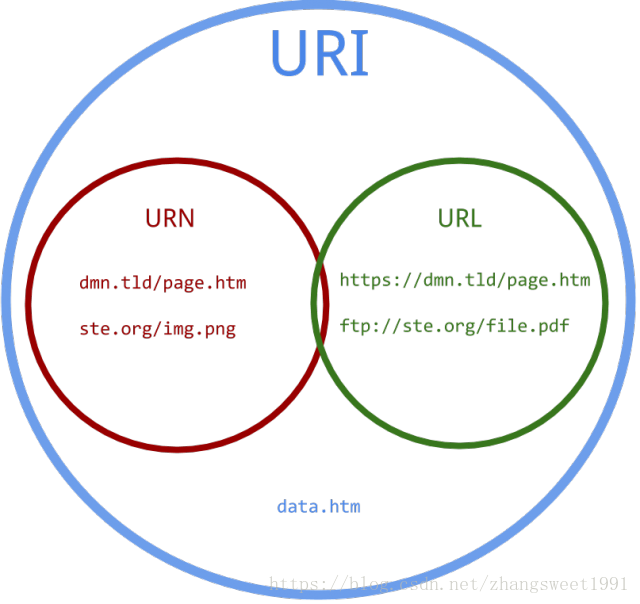

# Restful API

[影片-認識 RESTful API](https://www.youtube.com/watch?v=gHCB0sd47Is&feature=youtu.be)

[文件-認識 RESTful API](https://github.com/twtrubiks/django-rest-framework-tutorial/tree/master/RESTful-API-Tutorial)

## 介紹

1. 建立在 HTTP 協定之上的設計模式
2. 組成方式:
   * Resource : 資源 - 是由 URI 來指定
   * Representational : 像是 JSON，XML，YAML 等等......
   * State Transfer : 狀態傳輸。透過 HTTP 動詞實現 （GET，POST，PUT，DELETE）
3. 單從發出的HTTP請求裡面包含的資訊，就可以直接預期這請求會收到怎樣類型的資料

> RESTful API 讓我們以很優雅的方式顯示 Resource \( 資源 \)，
>
> Resource \( 資源 \) 是由 URI 來指定
>
> 對 Resource \( 資源 \) 的操作，包含取得、新增、修改和刪除資源，

## 比較

> 一般API設計

| 取得使用者 | api/get\_user |
| :--- | :--- |
| 新增使用者 | api/insert\_user |
| 更新使用者 | api/update\_user |
| 刪除使用者 | api/delete\_user |

> Restful API

| Http Method | 作用 | api呼叫接口 |
| :--- | :--- | :--- |
| \(GET\) | 取得使用者 | api/users |
| \(POST\) | 新增使用者 | api/users |
| \(PUT\) | 更新使用者資料 | api/users/1 |
| \(PATCH\) | 更新使用者部分資料 | api/users/1 |
| \(DELETE\) | 刪除使用者 | api/users/1 |

```text
從以上比較可看出，使用 RESTful API 我們只需要一個接口就可以完成
並且我們透過 HTTP 不同的 method 達到相對應的CRUD功能。
RESTful API 讓我們以很優雅的方式顯示 Resource ( 資源 )
```

## 優缺點

* 優點:

  > 資源和操作分離，讓對資源的管理有更好的規範以及前端（串接 API 或使用 API 的人），
  >
  > 可以很快速的了解你的 API ，省去很多不必要的溝通。

* 缺點:

  > 只要用戶了解了您的網站 URL 結構，就會開始產生安全性的問題，
  >
  > 可以任意對你的資料庫操作CRUD，我們一定要再處理對用戶進行身份驗證和授權。

## HTTP 狀態碼

200 OK 用於請求成功。 GET 檔案成功，PUT， PATCH 更新成功

201 Created 用於請求 POST 成功建立資料。

204 No Content 用於請求 DELETE 成功。

400 Bad Request 用於請求 API 參數不正確的情況，例如傳入的 JSON 格式錯誤。

401 Unauthorized 用於表示請求的 API 缺少身份驗證資訊。

403 Forbidden 用於表示該資源不允許特定用戶訪問。

404 Not Found 用於表示請求一個不存在的資源。

## 結論

很多時候，我們的業務邏輯非常複雜，會導致如果要很嚴格的遵守RESTful API 的規則，

就不是那麼的好用，所以，有時候還是可以在 RESTful API 做一些修改，不一定要完全遵守他的規則。

除了RESTful API 的概念之外，其他還有如何避免API 被攻擊，可以考慮啟用 API 調用速率限制（Rate limiting），又或是 HTTP Cache \(快取\)等等

## 補充: URI、URL、URN 之間差異

[URI和URL的區別，URN又是什麼](https://71a.xyz/p8qqZP)

### URI是（uniform resource identifier）統一資源標識符

> 用來唯一的標識一個資源。
>
> Web上可用的每種資源如HTML文檔、圖像、視頻片段、程序等都是一個來URI來定位的

* 訪問資源的命名機制
* 存放資源的主機名
* 資源自身的名稱，由路徑表示，著重強調於資源。

### URL是（uniform resource locator\) 統一資源定位器

> 它是一種具體的URI，可以用來標識一個資源，而且還指明了如何locate這個資源。
>
> 是Internet上用來描述信息資源的字符串，主要用在各種WWW客戶程序和伺服器程序上，特別是著名的Mosaic。

* 協議\(或稱為服務方式\)
* 存有該資源的主機IP位址\(有時也包括埠號\)
* 主機資源的具體地址。如目錄和文件名等

### URN是（uniform resource name\) 統一資源命名

> ## 是通過名字來標識資源，比如mailto:java-net@java.sun.com。
>
> **URI是以一種抽象的，高層次概念定義統一資源標識，而URL和URN則是具體的資源標識的方式。**



