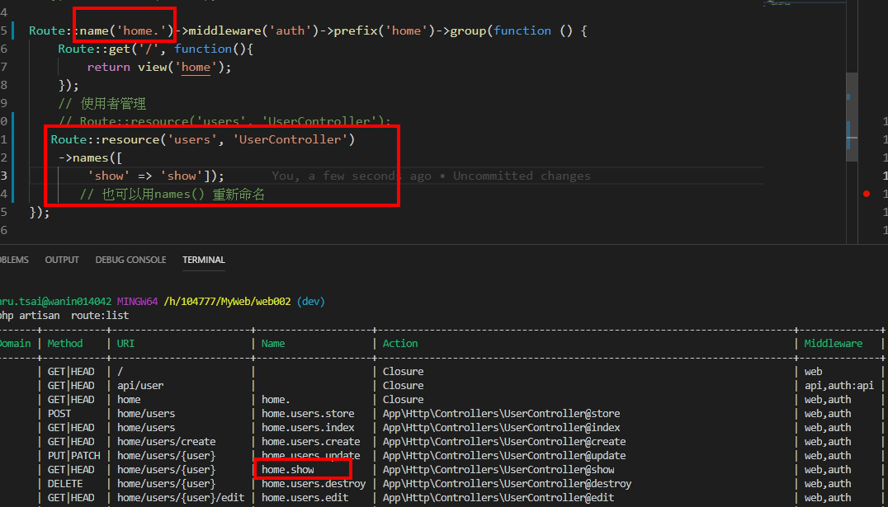

# 控制器

> 包含了控制器、中間件以及表單請求等，幾乎所有通過Web 進入應用的請求處理在這裡進行。
>
> 路徑: App\Http\Controllers

## 基本控制器

```bash
php artisan make:Controller TestController
```

1. 注意namespace 路徑
2. 引用 use App\Http\Controllers\Controller
3. 若有建立資料夾，則路由呼叫控制器需多一層資料夾 : 

```bash
php artisan make:Controller Admin/TestController
```

```php
// web路由
Route::get('test', 'Admin\TestController@show');
```

## API控制器 [參考 RESTful API 教學](https://learnku.com/articles/8380/some-of-the-experiences-of-laravel-developing-restful-api)

```bash
php artisan make:controller API/AuthController --api
```

```php
// api路由
Route::apiResource('/users', 'API\AuthController');
```


## Resful資源控制器

```bash
php artisan make:controller Backend/UserController --resource
```

```php
// resource路由
Route::resource('user', 'Backend\UserController');
```

## 查詢路由

```bash
php artisan route:list
```


## 補充

### 預設命名:


如果resource\(\) 外層還有一層路由命名’home’ 則呼叫該resource\(\)name時 預設名稱 ex =&gt; route\(homeusers.show\) 或是用names\(\)重新命名



> 將原先home更名為 「hmoe.」 resource 再搭配 運用names\(\)方法:重新定義名稱



### 若使用session方法，需要使用Middleware中間件

```bash
php artisan make:middleware AdminLogin
```

