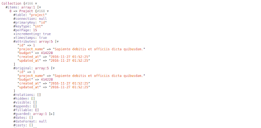

# 資料庫

[Laravel6 中文文檔 Eloquent：入門](https://learnku.com/docs/laravel/6.x/eloquent/5176)

## 環境設置

> .env 文件 \(連動phpstudy、phpAdmin設置\)

```text
DB_CONNECTION=mysql
DB_HOST=127.0.0.1
DB_PORT=3306
DB_DATABASE=連線名稱
DB_USERNAME=用戶名稱
DB_PASSWORD=密碼
DB_PREFIX=前綴 例如:blog_
```

> 有加 DB\_PREFIX **config.database.php 要配合更改 'prefix' =&gt; env\('DB\_PREFIX',''\)**

```php
 // 連線 
$pdo = DB::connection()->getPdo();
// 讀寫分離 => 可以個別指定要用哪一台伺服器讀資料,哪一台寫資料 配置: config/    .php 設定
 $pdo = DB::connection('mysql::write')->getPdo(); // 讀寫分離 指定數據庫(必填))和方法
```

```php
$pdo = DB::table('psepbdat')->get(); // 取得該表格(寫法1)
 // 查詢函數('SQL+命名',陣列key+val)
$sql = 'select *
          from psepbdat
          where emp_no = :emp_no';
$pdo = DB::select($sql,['emp_no'=>104777]);
----------------------------------------------------
// 查詢函數('SQL+?',陣列val)
$sql = 'select *
          from psepbdat
          where emp_no = ?';
$pdo = DB::select($sql,[104777]);
dd($pdo); // dd函數 與print_r函數相同 瀏覽器輸出
```


## 模型

> [Laravel Eloquent 用法](https://learnku.com/articles/6356/laravel-eloquent-usage)

### 創建模型 \(資料夾/模型名稱\)

```text
php artisan make:model Home/Member
```



預設config\auth.php 的Users ’model’ 路徑為:App\User::class, 若有更改路徑,需調整此配置。



### 配置屬性\(定義資料表內容\)

| 自定義項目 | 定義語法 |
| :--- | :--- |
| 表格名稱 | protected $table = '自訂表名'  預設:複數表名 |
| 主鍵 - 預設\(名稱:id、int型態\) | protected  $primaryKey = '自訂主鍵名'   protected  $keyType = 'string' |
| 序號: 預設:true \(自動增號\) | protected $incrementing = false |
| 時間戳: 預設會產生時間欄位: created\_at、update\_at | public $timestamps = false \(不產生\)   protected $dateForamt = 'Y-m-d' |
| created\_at、update\_at 時間的欄位名稱 | const CREATED\_AT = 'create\_time'    const UPDATED\_AT = 'update\_time' |
| 資料庫連接名稱 | protected  $connection = 連線名稱 |
| 屬性值 | protected $attributes = \['xx欄位' =&gt; 屬性\] |
| 那些欄位可在建立資料時可以批量賦值 | protected $fillable = \['xx欄位' =&gt; 屬性\] |
| 那些欄位可在建立資料時,應保護不能批量賦值 | protected $guarded = \['xx欄位' =&gt; 屬性\] |
| 那些欄位輸出陣列/json時,需要被隱藏 | protected $hidden = \['xx欄位' =&gt; 屬性\] |
| 那些欄位輸出陣列/josn時,需要被顯示 | protected $visible = \['xx欄位' =&gt; 屬性\] |
| 自定義日期格式(日期序列化) | protected $cast = \['birthday' =&gt; 'date:Y-m-d' \] |


> $fillable ,$guarded 與 $hidden, $visible兩組皆為各自反向的屬性，擇一使用即可


### 控制器調用模型

1. 直接像DB門面一樣的操作方式，以調用靜態方法為主的形式，該形式下模型不需要實例化，例如: 

   ```php
   User::get() 等於 DB::table('users')->get();
   ```

2. 實例化模型後再去使用模型類，例如: 

   ```php
   $users = new User();
   $users->get();
   ```

   

#### save\(\)

> 要在資料庫中建立一筆新記錄，只要建立一個新模型實例，並在模型上設定屬性，再呼叫 save 方法 批量賦值 create\(\)
>
> 在一行間儲存一個新的模型。被新增的模型實例將會從你的方法回傳。
>
> 在這樣做之前，你需要在你的模型上指定一個 fillable 或 guarded 屬性，因為所有的 Eloquent 模型有針對批量賦值（Mass-Assignment）做保護。
>
> \`\`\`php //新增方式1 $article = new Article\($request-&gt;all\(\)\); $article-&gt;save\(\); //新增方式2 $comment = new Comment; $result = $comment-&gt;create\($request-&gt;all\(\)\);

//單筆更新 : $find = User::find\($id\) $find-&gt;birthday = '2019-01-01' $find -&gt;save\(\)

```text
#### update()
> 批量更新 update([更新資料數組])

```php
public function updateORM()
{
    // ORM模式(印出bool)
    $find = Member::find(108108);
    $find->birthday = '1999/02/02';
    $result = $find->save();
    dd($result);

    // update方法(印出為異動筆數)
    $rowCount = Member::where('emp_no','=','108108')->update([
        'birthday'=>'1999/02/02'
    ]);
    dd($rowCount); // 印出異動筆數
}
```

#### delete\(\)

> 刪除

```php
public function deleteORM()
{
    $find = Member::find(108105);
    $result = $find->delete();
}
```

### 調用模型方法

> 查詢類方法--返回Builder _\*_ 所以可以結合撈取類與集合方法 返回Collect

| 方法 | 說明 |
| :---: | :---: |
| where\(\) | 查詢條件的所有項目 |
| orderBy\(\) | 對某欄位進行排序 |

> 撈取類方法-返回Collect

| 方法 | 說明 |
| :--- | :--- |
| all\(\) | 回傳該模型全部資料 |
| all\(‘name’\) | 回傳name欄位全部資料 |
| get\(\) | 取得所設定的搜尋句中所有的結果 |
| first\(\) | 只取第一筆結果 |
| find\(\) | 使用主鍵查詢結果 可傳單筆id也可傳id數組 |
| findOrFail\(\) | 模型找不到某筆資料的時候拋出異常 |
| firstOrFail\(\) | 模型找不到第一個結果的時候拋出異常 |
| select\('category\_id', 'name', 'description'\) | 子查詢Select |


all\(\) 前面不支持其他輔助的方法 =&gt; 報錯:BadMethodCallException


> Collection 集合功能: Illuminate\Database\Eloquent\Collection 的一個實例
>
> 可以直接對PHP 數組一樣對其進行迴圈循環取值

| 方法 | 說明 | 備註 |
| :--- | :--- | :--- |
| avg\(\) | 回傳某欄位的平均 | ex:計算產品類別為1的價格平均  Product::where\('category\_id',1\)-&gt;get\(\)-&gt;avg\('price'\); |
| max\(\) | 回傳該集合某欄位的最大值 | Product::get\(\)-&gt;max\(‘price’\); |
| min\(\) | 回傳該集合某欄位的最小值 |  |
| sum\(\) | 回傳該集合某欄位的總和 |  |
| take\(\) | 從集合中回傳特定數目的資料 | take\(3\)-抓前三筆，take\(-3\)抓最後三筆 |
| count\(\) | 回傳集合的資料總數 |  |
| randow\(\) | 從集合中隨機挑一筆出來 |  |
| toJson\(\) | 將集合的資料轉換為Json格式 |  |
| toArray\(\) | 將集合的資料轉換為Array格式 | 會把集合中的attributes資料 轉成陣列 |

```php
// 查詢資料
public function selectData(Request $request)
{
    // 查詢depart=4940 多筆emp_no欄位(array格式))
    $find = Member::where("depart", '=',4940)->select('emp_no')->get()->toArray();
    // 查詢depart=4940 多筆emp_no,emp_nam欄位(array格式))
    $find = Member::where("depart", '=',4940)->select('emp_no','emp_nam')->get()->toArray();
    // 查詢 depart=4940 第一筆資料(array格式))
    $find = Member::where("depart", '=',4940)->first()->toArray();
    // 查詢全部資料(json格式))
    $find = Member::all()->toJson();
    // 判断一个参数在请求中是否存在，并且不为空，需要使用 filled 方法：
    if($request->filled('emp_no')) {
        $find = Member::find($request);
}
```

```php
// 查詢指定id並回傳陣列
$find = User::find(1);
 $reslut = $find->toArray();
```

### 自定義範圍查詢

> 可在model裡定義查詢函式 1. 函式開頭名稱需加上前綴scope 例如:scopeOrderByPrice\(\)

```text

```

1. 呼叫自定查詢函式不用再加上scope,且函式名稱第一個字小寫 呼叫 orderByPriec\(\)

   

## 集合

> 便利於操作搭配可調用的[方法](https://xueyuanjun.com/post/19959.html) 或[這篇統整](https://docs.laravel-dojo.com/laravel/5.5/collections#method-contains)
>
> Illuminate\Support\Collection類提供了一個流暢，便利的封裝來嵌入複製數據。
>
> Eloquent返回的包含多條記錄的結果集都是Illuminate\Database\Eloquent\Collection對象的實例，
>
> 包括通過get方法或者通過訪問關聯關係獲取的結果。
>
> Eloquent集合對象繼承自Laravel的集合基類，因此很自然的繼承了很多處理Eloquent模型底層數組的方法。
>
> 以得到的Collect結果去調用方法。



> 或是自己創建集合資料
>
> ```php
> $collection = collect([1, 2, 3]);
> ```


## 關聯

### 關聯對應


**舉例:產品類別category與產品product的關聯 1對多**

### 使用關聯

> 模型調用 model中 定義的product關聯方法
>
> ```php
> $data = Category::find(1)->product();
> $products = Category::find(1)->product()->first()->price // 回傳該筆類別1產品價格
> $data = Product::find(1)->category; // 回傳category模型資料
> $data = Product::find(1)->category(); // 透category()查詢器查詢 擁有id欄位且欄位值為2的資料
> ```

### 遠層關聯

### 多態關聯
>多態關聯允許目標模型在單個關聯下歸屬於多種不同的模型。


## 資料填充 seed

### 建立填充

> 約定名稱:大寫表名+TableSeeder
>
> 填充的方式可以模型工廠產生,或是單筆新增

```text
php artisan make:seeder ProductTableSeeder
```

### 建立模型工廠\(產生填充資料\)

[工廠資料定義的使用方式](https://www.jianshu.com/p/80c6974de34f)

[laravel faker數據填充詳解](https://www.itread01.com/content/1548781334.html)

[Github文件-fzaninotto/Faker](https://github.com/fzaninotto/Faker)

> 若模型已經建立,可以在建立模型工廠時加入指示 --model = 資料夾/模型

```text
php artisan make:factory ProductFatory --model=Models/Product
```


```php
$factory->define(ArticleCategory::class, function (Faker $faker) {
    return [
        // '欄位'=>'填充內容'
        'name'=> '運動',
        'description'=> '[描述]'.$faker->bs(),
        'category_id' => $faker->numberBetween(1,5),
        'name' => '[商品名]'.$faker->country(),
        'unit' => '個',
        'price' => $faker->randomFloat(2, 1, 10000),
        'specification' => '[規格]'.$faker->colorName(),
        'inventory' => $faker->numberBetween(1, 30), //生成隨機整數，範圍是1-30之間
        'safety_stock' => $faker->numberBetween(1, 50), //生成隨機整數，範圍是1-50之間
        // 'image_path' => $faker->image('public/uploads',400, 300), // 無法產生圖片
        'image_path' => $faker->imageUrl(), // 產生圖片url
        'remark' => '[備註]'.$faker->bs(), // 返回一段文本，最多只能含有200個字符
       'title' => '標題:'.$faker->catchPhrase(), // 口號
        'content' => $faker->realText($maxNbChars = 200, $indexSize = 1), // 文本
        'category_id' => $faker->numberBetween(1, 2),
    ];
});
```

> 中文化:可通過在 config/app.php 增加如下配置使其支持中文： 'faker\_locale' =&gt; 'zh-TW',
>
> 後來發現只有修改AppServiceProvider才有中文化作用


```php
// 工廠中文化 綁定一個單例
$this->app->singleton(\Faker\Generator::class,function(){
    return \Faker\Factory::create('zh_TW');
});
```

> 補充: :綁定一個單例（Singleton）
>
> singleton 方法綁定一個類別或介面至容器中，只會被解析一次，且爾後的呼叫都會從容器中回傳相同的實例：
>
> \`\`\`php $this-&gt;app-&gt;singleton\('HelpSpot\API', function \($app\) { return new HelpSpot\API\($app-&gt;make\('HttpClient'\)\); }\);

```text
### 撰寫填充內容

* 單筆數組填充


* 模型工廠填充

```php
<?php
use App\Models\Article;
use App\Models\ArticleCategory;
use App\Models\Comment;
use Illuminate\Database\Seeder;

{
    /**
    * Run the database seeds.
    *
    * @return void
    */
    public function run()
    {
        /// 產生1個分類
        factory(ArticleCategory::class,1)->create();

        // 1個分類 2篇文章 2個評論
        factory(ArticleCategory::class, 1)->create()
            ->each(function($category) {
                $category->article()->saveMany( factory(Article::class, 2)->make() )
                        ->each(function($article){
                            $article->comment()->save(factory(Comment::class)->make());
                        });
        });
    }
}
```

### 調用其他填充器

> 開啟 database/seeds/DatabaseSeeder.php 文件，並修改 run\(\)


### 執行資料

1. 撰寫好填充器類之後，需要通過 dump-autoload 命令重新生成 Composer 的自動加載器：

   ```text
    composer dump-autoload
   ```

2. 執行填充器
   * 方法1:直接指定填充器名稱

     ```text
     php artisan db:seed --class=填充器名稱
     ```

     

* 方法2:由DatabaseSeeder的run函數去call\(填充器名稱\)

  ```text
   php artisan db:seed
  ```