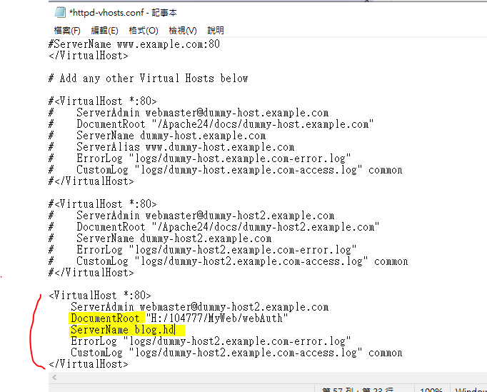

# 環境安裝

## 設定開發環境

[網站開發環境工具介紹-影片\(node、git、vsCode及套件、scss\)](https://www.youtube.com/watch?v=bcgL1sCjAJA&list=PLEfh-m_KG4dZcmTWAHWDgiLhkFAQh-xpA&index=1)

### 安裝 phpstudy2018 [教學文件](https://my.oschina.net/u/3803405/blog/1811018)

* 解壓縮後-&gt; 下載vC9 32位元\(必安裝\) -&gt;設定網域 -&gt; 啟動
* 環境變數設定 本機右鍵-&gt;內容-&gt;進階系統設定-&gt;環境變數.......


### 安裝開發工具  VScode

[vscode與composer設定環境變數](https://ithelp.ithome.com.tw/articles/10190770)


**使用date\_default\_timezone\_set 出現錯誤**

在 php.ini 加上 date.timezone = Asia/Taipei 。改完記得重開 HTTP Server


#### VS code

* 外掛套件
  * PHPUnit Test Explorer 
  * PHPUnit Snippets
  * User snippets  : 根據不同語言的設計,可在不同網站使用
  * BluePrint : 結構化產生某個重複性樣板
  * Live Server 即時預覽網頁

    **預設port=5500若port有衝突無法開啟,再更改設定liveServer.settings.port** 

  * Node Exec: 可單獨測試js語法及執行 q
  * path intellisense : 路徑提示
  * Live Sass Compiler
  * 版控
    * Git Lens : 可得知某行程式碼修改者是誰\(團隊\)
    * Git history : 視覺化工具
    * gitflow : 固定的版控方式
    * gitignore : 排除不需要版控的管理
    * git-autoconfig : git帳號切換
  * 排版
    * JS-CSS-HTML Formatter
    * ESLint : 針對ES規範
    * Document This : 註解
  * 檔案
    * VSCode Great Icons
  * project
    * Project Manager
  * Laravel
    * Laravel Blade Snippets    
    * Laravel 5 Snippets   
    * Laravel Artisan   
* [基本快捷鍵](https://reurl.cc/Rdm73z)

> 指令:

```markup
<!DOCTYPE html>
<html lang="en">
<head>
    <meta charset="UTF-8">
    <meta name="viewport" content="width=device-width, initial-scale=1.0">
    <meta http-equiv="X-UA-Compatible" content="ie=edge">
    <title>Document</title>
</head>
<body>

</body>
</html>
```

> 指令: \#+id名稱

```markup
<div id=id名稱> </div>
```

> 指令: header&gt;h1+nav

```markup
<header>
    <h1></h1>
    <nav></nav>
</header>
```

> 指令: ul&gt;li/\*5&gt;a

```markup
<ul>
    <li><a href=""></a>
    <li><a href=""></a>
    <li><a href=""></a>
    <li><a href=""></a>
    <li><a href=""></a>
</ul>
```

### 安裝版本控制  Git

* [GUI 界面來管理版本控制內容的軟體 Sourcetree](https://ithelp.ithome.com.tw/articles/10206852)

### 安裝nvm [安裝教學](https://www.onejar99.com/nvm-install-for-windows/)

> NVM \(Node Version Manager\) 幫助 Node.js 的版本控管和快速切換
>
> \(2019-10-14起 安裝新版nvm即可下指令安裝node\)


### 練習 [用 VS Code 輕鬆寫 PHP 測試 ](https://www.youtube.com/watch?v=ZWootMKhhj4)

* 進入cmd 指令之前需要先安裝
  * 安裝 composer、git
  * 安裝 後重啟cmd
* 跟著畫面下指令
  * 切換資料夾 =&gt;   cd /d H:\104777\phpunit-vscode
  * 新增資料夾=&gt; mkdir phpunit-vscode
  * 測試git是否安裝成功 =&gt; git --version

### 安裝 Xdebug 坑

> 若發現vscode 無法執行Xdeug時 解決方式


確認phpStudy開啟php版本，要注意從這邊開啟的文件不一定是對應的版本php.ini檔案



* 通过phpinfo\(\)查看自己的php信息\(index.php\)
* 可透過下載Xdebug的版本分析，確認對應的Xdeug版本 [下載點](https://xdebug.org/download)
* php.ini 檔案需含有以下設定,並將zend\_extension底下指向下載的路徑

```bash
[XDebug]
xdebug.profiler_output_dir="H:\104777\phpStudy\PHPTutorial\tmp\xdebug"
xdebug.trace_output_dir="H:\104777\phpStudy\PHPTutorial\tmp\xdebug"
zend_extension="H:\104777\phpStudy\PHPTutorial\php\php-7.2.1-nts\ext\php_xdebug-2.7.2-7.2-vc15-nts.dll"
xdebug.remote_enable = 1
xdebug.remote_autostart = 1
```

### 安裝 Composer

> 管理PHP套件
>
> * [Download Composer](https://getcomposer.org/download/)
> * [Composer教學說明](https://changken.org/1284)
> * [使用Composer管理PHP套件](http://blog.tonycube.com/2016/12/composer-php.html)
> * [解析 Laravel 的 composer.json 配置](https://xnote.dev/laravel-composer-json.html)
>   * 透過分析專案 composer.json 可以快速瞭解用了哪些套件，方便熟悉一個專案。
>   * 了解Laravel專案結構目錄


### 安裝 Laravel

#### 專案建立

1. 通過 Composer Create-Project

   ```bash
   composer create-project --prefer-dist laravel/laravel blog
   ```

2. 利用 Composer 下載 Laravel 安裝器後，透過laravel安裝器安裝

```bash
composer global require "laravel/installer"

laravel new MyWeb
```



若是安裝出現缺少 **fileinfo PHP擴展錯誤** 導致未出現vendor資料夾,處理方式:

修改對應的php.ini文件配置:新增 ;extension=fileinfo


> 安裝成功訊息


> 查看 Laravel 的版本
>
> ```bash
> php artisan -v
> ```
>
> 使用PHP內置的開發環境服務器為應用提供服務，可以使用 Artisan 命令 serve：
>
> ```bash
> php artisan serve
> ```
>
> * 預設url: [http://localhost:8000/](http://localhost:8000/)
> * 手動新增埠號 來開啟其他對應的網站，需要重新設定.env 環境配置 ex: [http://localhost:9999](http://localhost:9999)

## 配置專案環境

### Laravel 時區 [教學](https://reurl.cc/RdmZLn)

> config/app.php 中的 timezone 參數 1. config/app.php 設定檔設定才有效果 2. 若設定完時區後下此指令，則會保存設定不再變動
>
> ```bash
> php artisan config:cache
> ```
>
> 若需要更改需再清除 :
>
> ```bash
> php artisan config:clear
> ```
>
> 1. phpStudy 更改php.ini 檔後 Laravel需要重啟才有作用

### Laravel 域名

[影片教學](https://www.youtube.com/watch?v=a2Z_wGRCx3w&list=PLAYoruToK_vNbGXmCTPW8zGVuAz0jeBTY&index=4)

[Apache Rewrite with Htaccess 理解與技巧](https://medium.com/@awonwon/htaccess-with-rewrite-3dba066aff11)

1. httpd.conf檔案 以下需拿掉\#

```text
LoadModule rewrite\_module modules/mod\_rewrite.so

LoadModule vhost\_alias\_module modules/mod\_vhost\_alias.so

Include conf/extra/httpd-vhosts.conf

DocumentRoot  <= 改成phpStudy\PHPTutorial\WWW

AllowOverride All  <= 要修改成這樣內容

Require all granted  <= 要修改成這樣內容
```

1. 修改  httpd-vhosts.conf 檔案，**新增紅筆區域以及調整黃底標題內容**

```text
   
專案名稱  DocumentRoot"H:/104777/MyWeb/webAuth"

域 名 ServerName blog.hd

檔案路徑 phpStudy\PHPTutorial\Apache\conf\extra

```




1. 修改host.php，路徑:C:\Windows\System32\drivers\etc，或phpStudy其他選項菜單 =&gt;打開hosts
2. 專案資料夾下的 server.php 改為 index.php
3. 將public/.htaccess複製到專案資料夾下

## 目錄結構

[Laravel目錄結構](https://xueyuanjun.com/post/9610)

## 配置clone下來的專案

### Laravel
```bath
composer install
composer run post-root-package-install (若沒有.env)
composer run post-create-project-cmd (產生key)
npm install (安裝 Laravel Mix)
npm run dev  (執行所有 Mix 任務...)
```

```text
// 配置.env文件
APP_URL=http://localhost
CLIENT_URL=http://localhost:3000
DOMAIN_FRONTEND=localhost:3000 
DOMAIN_BACKEND=localhost
DOMAIN_FILESTORAGE= <api廠商>
DB_DATABASE = <phpadmin資料庫名稱>
```

### 資料庫
> 遇到長度錯誤，schema表結構調整:

COLLATE=utf8mb4_unicode_ci 再後面加上 ROW_FORMAT = DYNAMIC; 
ex: COLLATE=utf8mb4_unicode_ci ROW_FORMAT = DYNAMIC; 

>mysql.ini配置(選單->打開配置文件)

* innodb_large_prefix
* innodb_file_per_table=true
* innodb_file_format=Barracuda
* default-storage-engine=INNODB

>報錯:ERROR 1231 (42000): Variable 'time_zone' can't

[解决ERROR 1231 (42000)錯誤](https://blog.51cto.com/9285090/2119091)

Variable 'time_zone' can't be set to the value of 'NULL'
修改mysql配置文件:max_allowed_packet=1024M
重啟=>似乎無效，後來處理方式移掉相關註解/* */;

[phpmyadmin 匯入檔案大小設定](https://reurl.cc/ZO14Dp)

修改配置檔php.ini，加大檔案上傳大小(upload_max_filesize)

設定說明:
* upload_max_filesize：上傳檔案的最大限制，預設 2M，可調整。
* post_max_size：POST的資料量限制，預設 8M，可調整。
* memory_limit : 記憶體限制，預設 8M，可調整。

調整時要注意的地方，必須是：
* memory_limit > post_max_size > upload_max_filesize


### Vue
```bath
npm install
```

```text
// 配置

apiUrl: process.env.API_URL || 'http://127.0.0.1:8999/api',

npm run dev 啟動服務 3000
```