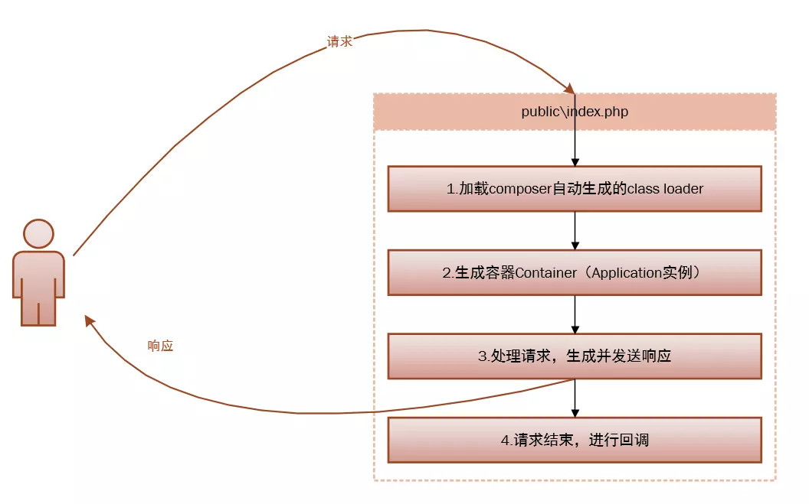
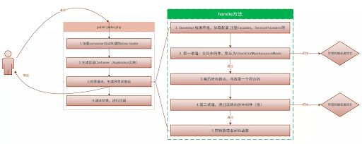

# 生命週期

[Laravel 的生命周期介紹\(簡書\)](https://www.jianshu.com/p/08b810b720d9)



## 流程

> ## public/index.php
>
> 加載初始化第三方依賴。，包括所有composer require的依賴
>
> ```php
> define('LARAVEL_START', microtime(true));
> ```
>
> 取得Application實例
>
> ```php
> $app = require_once __DIR__.'/../bootstrap/app.php';
> ```
>
> 處理請求，生成並發送響應 生成容器Container 並向容器註冊核心組件（HttpKernel，ConsoleKernel ，ExceptionHandler\)
>
> ```php
> $kernel = $app->make(Illuminate\Contracts\Http\Kernel::class);
> $response = $kernel->handle(
>       $request = Illuminate\Http\Request::capture()
>    );
> ```
>
> 請求結束，進行回調
>
> ```php
> $kernel->terminate($request, $response);
> ```

服務容器: 管理類別依賴與執行依賴注入的強大工具 bootstrap/app.php 取得 [Laravel服務容器物件](https://learnku.com/docs/laravel/6.x/container/5131)



## 說明

### 入口 public/index.php

> 載入框架其他部分的起點

### HTTP / 終端核心

> 所有請求在處理前需要經過的HTTP 中間件

#### 註冊中介層 app/Http/Kernel.php 可參考 [中間件](middleware.md)

> **繼承Illuminate\Foundation\Http\Kernel** 定義了 **bootstrappers** ， **注意有順序性**
>
> ```php
> // Illuminate\Foundation\Http\Kernel.php
>
> protected $bootstrappers = [
>      // 註冊系統環境 （.env）
>            \Illuminate\Foundation\Bootstrap\LoadEnvironmentVariables::class,
>
>      // 註冊系統配置 (config)
>            \Illuminate\Foundation\Bootstrap\LoadConfiguration::class,
>
>      // 註冊異常處理
>            \Illuminate\Foundation\Bootstrap\HandleExceptions::class,
>
>     //註冊服務容器的Facade門面(Facade是提供從容器訪問對象的類)
>        註冊Facades就是註冊config\app.php中的aliases數組 
>            \Illuminate\Foundation\Bootstrap\RegisterFacades::class,
>
>     // 註冊服務提供者
>            \Illuminate\Foundation\Bootstrap\RegisterProviders::class,
>
>     // 註冊服務提供者 'boot’
>            \Illuminate\Foundation\Bootstrap\BootProviders::class,
>    ];
> ```
>
> 根據請求類型將傳入的請求轉發到 HTTP 核心或控制器核心
>
> * 中間件 Middleware: 過濾進入應用程序的 HTTP 請求
>   * 「前行中介層」，就是先執行中介層內容，再丟給下一個接收的人處理。
>   * 「後行中介層」，先請下個接收 request 的人執行，執行完在回頭執行中介層內容。
> * 服務提供者: 服務容器綁定都會在服務提供者中被註冊,是所有 Laravel 應用程式啟動的中心
>   1. 所有服務提供者都被設定在 config/app.php 設定檔的 providers 陣列
>   2. 啟動時載入所有的框架各式元件，像是資料庫、隊列、驗證和路由元件

### 調度請求

> 應用程式一旦被啟動載入並註冊了所有的服務提供者，那麼 Request 就會被轉交給路由器來進行調度。
>
> 路由器會將請求調度到路由或控制器，並執行任何特定的路由中介層。
>
> 1. 應用程式一旦被啟動載入並註冊了所有的服務提供者Request 就會被轉交給路由器來進行調度
> 2. 路由器將請求發送到路由器 route或控制器 controller 或任何運行於路由的特定中間件。

