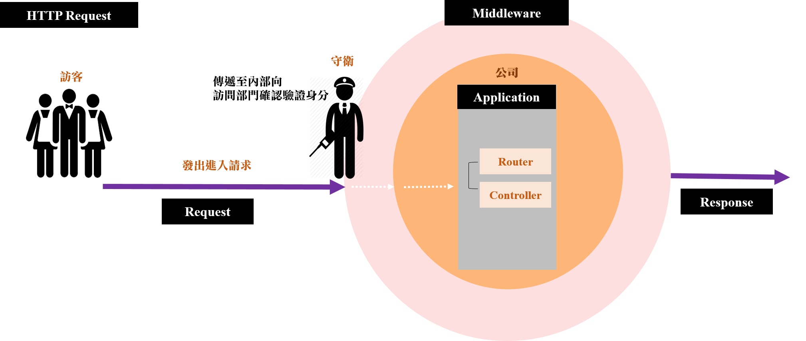
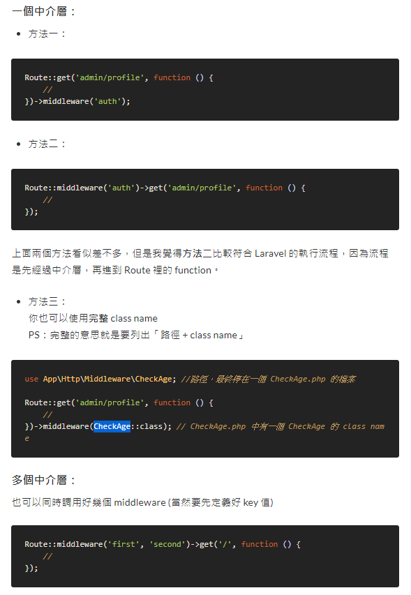

# 中間件

[Middleware 中間件介紹 \(認證的許可\)](https://ithelp.ithome.com.tw/articles/10208371?sc=iThelpR)

[[教程] 大白话 Laravel 中间件)](https://learnku.com/laravel/t/27426)



[生活化範例-參考來源](https://ithelp.ithome.com.tw/articles/10223325)

## 用途
> HTTP 請求到達目標動作之前必須經過的“層”，每一層都會檢查請求並且可以完全拒絕它
>
> 比對使用者的請求資料是不是符合我們的要求
>
> * 符合，就繼續下一個個程序
> * 不符合，導向另外一個頁面 or 回傳一個錯誤訊息

## 創建中間件步驟
* 使用artisan命令創建中間件
* 在app→Http 文件夾中的kernel.php 中註冊中間件
* 在創建的中間件中編寫邏輯
* 將中間件分配給路由或控制器

## 創建中間件 路徑 app/Http/Middleware.php
```php
// <MiddlewareName>創建的名稱
php artisan make:middleware <MiddlewareName>
```

## 註冊中間件 路徑 app/Http/Kernel.php
> 讓該中間件可被使用，例如：在Kernel.php $routeMiddleware 定義，就可用 middleware 方法將中介層指派路由上

註冊類別:
* 全局中間件($middleware)
* 中間件組($middlewareGroups)
* 指定路由中間件($routeMiddleware)
* 排序中間件($middlewarePriority)

### 全局中間件\(Global Middleware\)

全部請求進來一定都要先經過這個中介層處理

```php
protected $middleware = [ 
   
];
```

### 路由中間件

一旦在此定義了 key name，在 route 中就可以使用以下方法直接調用

```php
protected $routeMiddleware = [ 
   
 ];
```

### 群組中間件

方便重複調用多個中介層

預設所有的路由會套用web的路由中介層群組

```php
protected $middlewareGroups = [ 
   
 ];
```

### 指定中間件優先級

```php
protected $middlewarePriority = [ 
   
 ];
```

## 中間件請求檢查順序
1.前置中間件

```php
	
<?php

namespace App\Http\Middleware;

use Closure;

class BeforeMiddleware
{
    public function handle($request, Closure $next)
    {
        // 执行一些任务

        return $next($request);
    }
}
```
2.後置中間件

```PHP
<?php

namespace App\Http\Middleware;

use Closure;

class AfterMiddleware
{
    public function handle($request, Closure $next)
    {
        $response = $next($request);

        // 执行一些任务

        return $response;
    }
}
```
## 應用中間件

* 在控制器，使用__construct方法，可再搭配 except()、 only()方法

```php
public function __construct()
{
    $this->middleware('guest')->except('logout');
}
```

* 通過路由使用

```php
// 中間件參數語法(中間件名:參數名) ex: 'guest:api'，中間件參數為api
Route::group(['middleware' => 'guest:api'], function () {
}

Route::group(['middleware' => 'auth:api'], function () {
}
```




## 中介層參數 <middlewareNam:param>
>在路由中可使用冒號 : 來區隔中介層名稱與指派參數，多筆參數可使用逗號作為分隔

```php
// 路由寫法1
Route::group(['middleware' => 'role:editor'] function () {

});

// 路由寫法2
Route::put('post/{id}', function ($id) {
    
})->middleware('role:editor');
```

```php

// middleware CheckRole

<?php

namespace App\Http\Middleware;

use Closure;

class CheckRole
{
    /**
     * 處理傳進來的請求。
     *
     * @param  \Illuminate\Http\Request  $request
     * @param  \Closure  $next
     * @param  string  $role
     * @return mixed
     */
    public function handle($request, Closure $next, $role)
    {
        if (! $request->user()->hasRole($role)) {
            // 重導...
        }

        return $next($request);
    }

}
namespace App\Http\Middleware;

use Closure;

class CheckRole
{
    /**
     * 處理傳進來的請求。
     *
     * @param  \Illuminate\Http\Request  $request
     * @param  \Closure  $next
     * @param  string  $role
     * @return mixed
     */
    public function handle($request, Closure $next, $role)
    {
        if (! $request->user()->hasRole($role)) {
            // 重導...
        }

        return $next($request);
    }

}
```