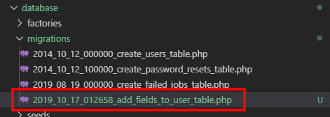

# 遷移


[資料庫遷移教學影片](https://www.youtube.com/watch?v=6_i8KDVpcbk&list=PLeE38-H82SvgvFz7u5Kbk6kJY0_Lg5mG-&index=29)

## 創建遷移

### 新增表格

> 同時建立模型與遷移文件
>
> ```text
> php artisan make:model Models/Product --migration
> ```
>
> 或單純增加表格
>
> ```text
> php artisan make:migration create_表格名稱_table
> ```


### 原表格增加欄位
> 假設是在users表格新增欄位
>
> ```text
> php artisan make:migration add_欄位名稱_to_表格名_table --table=表格名
> ```


> 產生遷移文件




### 編輯遷移文件

> 方法 up\(\) down\(\)


* $tabel 表示整個表的實例
* 語法:$table-&gt;列類型的方法\(欄位名稱,\[類型/長度\]\)-&gt;修飾的方法:ex:不為空\(\[修飾的值\]\);

  > 新的Schema Schema::create\(\)
  >
  > 後續維護 Schema::table\(\)

```php
Schema::create('migration_users', function (Blueprint $table) {
    $table->increments('id'); // integer主鍵
    $table->string('name',32); // VARCHAR
    $table->char('birthday', 10);
    $table->timestamps();    
});
```

### 軟刪除

> 並不是真的從數據庫中刪除了。是在模型上設置了 deleted\_at 屬性並將其值寫入數據庫
>
> 要開啟模型軟刪除功能，你需要在模型上命名空間設定 Illuminate\Database\Eloquent\SoftDeletes
>
> 遷移文件要設置方法 $table-&gt;softDeletes\(\);
>
> ```php
> public function up()
>     {
>         Schema::create('categories', function (Blueprint $table) {
>             $table->bigIncrements('id');
>             $table->string('name');
>             $table->integer('manual_order')->default(0);
>             $table->softDeletes(); // 軟刪除
>             $table->timestamps(); 
>             $table->foreign('user_id')->references('id')->on('users')->onDelete('cascade'); // 外鍵約束,加入聯級
>         });
>     }
> ```
>
> 模型匯入softDeletes特徵
>
> ```php
> use Illuminate\Database\Eloquent\SoftDeletes;
> class Category extends Model
> {
>  use SoftDeletes;
>  $protected $date = [‘deleted_at’];
> }
> ```
>
> 要確認給定的模型實例是否已經被軟刪除，可以使用 trashed 方法：
>
> ```php
> if ($category->trashed()) {
>    //
> }
> ```
>
> ### 執行遷移
>
> ```text
> php artisan migrate
> ```

### 回滾遷移

> 針對同一批次號:只刪除表格與遷移的紀錄,但是遷移文件還保留
>
> ```text
> php artisan migrate:rollback
> ```