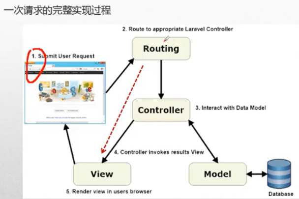
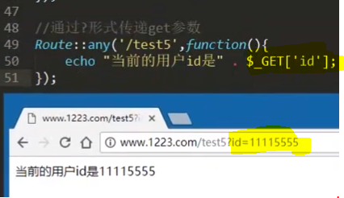

# 路由



> 預設網頁路由設定 routes/web.php


**如果要改預設的路徑**

RouteServiceProvider 中的 mapWebRoutes\(\)方法更改


## 語法

```php
// Route::HTTP請求('路徑', '若有資料夾\控制器@方法')
Route::get('/admin', 'Admin\CommonController@index');

// Route::HTTP請求('路徑', $callback)
Route::get('hello', function () {
    return 'Hello, Welcome to LaravelAcademy.org';
});
```

> 參數1: 視圖文件的名字，如果是 / 代表是當前路徑 例如: [http://localhost:8000/](http://localhost:8000/)
>
> 參數2: 接收回傳資料 若有一層資料夾則寫法: 資料夾名稱\xxxController@方法

## Http 請求動作方法:

```php
Route::get($uri, $callback);
Route::post($uri, $callback);
Route::put($uri, $callback);
Route::patch($uri, $callback);
Route::delete($uri, $callback);
Route::options($uri, $callback);
```

> 多個請求動作可透過 match方法來實現。

```php
Route::match(['get', 'post'], 'foo', function () {
    return 'This is a request from get or post';
});
```

> 或使用any方法註冊一個路由來響應所有HTTP請求動作：

```php
Route::any('bar', function () {
    return 'This is a request from any HTTP verb';
});
```

>

## 重新定向 redirect()


```text
**小心用,若加上301狀態瀏覽器會快取存取**
```



```php
Route::redirect('/', '/there', 301);
```

## 可選參數

> 該參數為選填, 路徑名稱+? 且法方需預設空值

```php
Route::get('hello/{name}/{age?}', function($name, $age = null){
    // code
});
```

> 或是用?形式傳送get參數



> 全域參數 在RouteServiceProvider類的boot方法中定義這種約束模式

## 正規表示式

> 避免使用者手動輸入 URI，導致 route 在讀取參數時，因參數格式錯誤而回饋錯誤訊息。
>
> 1. 單一變數  **where\(\)方法**
> 2. 全域參數在 App\Providers\RouteServiceProvider.php 的boot方法中定義這種約束模式

## 路由命名 name\(\)

> 使用 route('name()之命名名稱') 来生成連結或者重定向到該路由

```php
// 指定控制器行為的路由名稱 (定向到 http://127.0.0.1:8000/user/profile)
Route::get('user/profile', 'UserProfileController@show')->name('profile');

// 生成指定路由的URL
$url = route('profile');

// 生成重新定向
return redirect()->route('profile');
```

## 路由組 group()
> 共享屬性，以數組的形式傳入Route::group方法的第一個參數中

* 前綴 prefix() 可為路由組中所有路由的URI加上前綴：

```php
// 寫法1
Route::prefix('admin')->group(function () {
    Route::get('users', function () {
        // Matches The "/admin/users" URL
    });
});

Route::namespace('Auth')->prefix('auth')->middleware(['auth:api'])
    ->group(function () {
    Route::get('/user', 'AuthController@userData');
});

// 寫法2 路由分組+前綴詞運用 Route::group(['prefix'=>'index'], 呼叫方法);
Route::group(['prefix'=>'index'],function(){
    Route::get('shop/{id}', 'Admin\testController@show');
});
```

* 命名空間  namespace\(\) 方法 

  > 將相同的PHP命名空間分配給路由組的中所有的控制器

```php
Route::namespace('Auth')->group(function(){
    Route::get('/home', 'LoginController@index')->name('home');
});
```