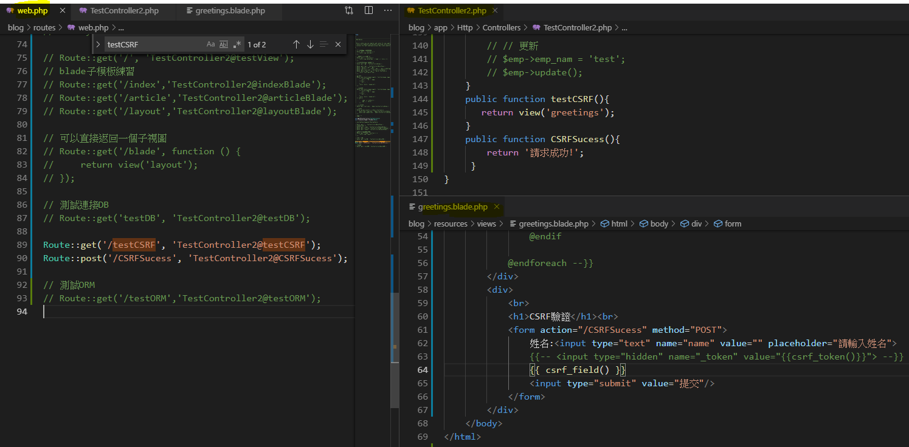
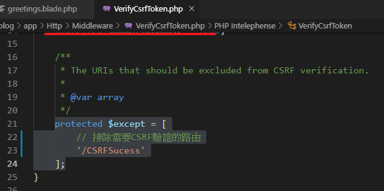
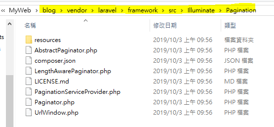
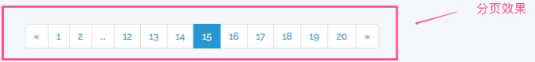
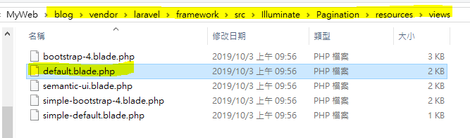

# 視圖

## 視圖 View

> 路徑: resources\views
>
> 視圖副檔名 「 .blade.php」

* [Blade 模板引擎](https://xueyuanjun.com/post/19941.html)
* [Controller 傳值到視圖View](https://learnku.com/articles/18321)

### 搭配變數傳入 view 中的方式

> with\(\)
>
> ```php
> return view('user.index')->with('users', $users);
> ```
>
> Array $變數
>
> ```php
> $data = ['name'=>'JOY'];
> ```
>
> compact\(\) 可傳多組陣列資料
>
> ```php
> return view('users.edit', compact('user'));
> ```

### blade模板 基礎用法

```php
//輸出name變量
{{$name}}

//@ 註解:不輸出name變量
@{{name}}

//如果name存在就輸出name，如果不存在就輸出Default
{{$name or 'Default' }}   

//如果name存在就輸出name，如果不存在就輸出Default
{{ isset($name) ? $name :'Default' }}  

// 默認情況下，Blade的{{ }}語句已經通過PHP的htmlentities函數處理以避免XSS攻擊，
// 如果你不想要數據被處理，比如要輸出帶HTML元素的富文本，可以使用如下語法：
Hello, {!! $name !!}
```

### blade模板子視圖運用

```php
// 定義佈局 語法:@include(資料夾.blade名稱,’參數’)
@include('view.name')
@include('view.name', ['some' => 'data'])
// 繼承佈局
@extends('layouts.app')
// 定義了一個內容片段
@yield('content')
// 顯示 yield 給定片段的內容
@section('content')
```

### 組件& 插槽

#### alert視圖

```markup
<div>
    <div>{{ $title }}</div>
    <p>接組件的變數----{{$test}}</p>
    {{ $slot }}
</div>

<!--component組件運用 alert視圖-->
@component('alert',['test'=>'測試變數'])
    @slot('title')
        title:定義的title變數
    @endslot
        輸出slot其他沒有另外定義的變數 
@endcomponent
```

#### 取好別名後使用

設置步驟: 1. 提供器設置: App\Providers\AppServiceProvider

* use Blade
* boot方法裡定義別名

  ```text
  Blade::component('common.alert', 'alert');
  ```

  1. 子視圖用別名來

     ```markup
     @alert(['title'=>'title:定義的title變數',
     'test' => '測試變數',
     'slot'=>'輸出slot其他沒有另外定義的變數
     ])
     <strong>Whoops!</strong><br>
     @endalert
     ```

     **區段的 @前綴詞用法**

     ```text
     @verbatim
     @endverbatim
     ```

## CSRF驗證練習

```php
// laravel 6 寫法
@csrf
// 寫法 2
{{ csrf_field() }}
// 寫法 3
<input type="hidden" name="_token" value="{{csrf_token()}}">

// 欺騙方法
@method('DELETE')
```




排除例外的路由\(不須驗證白名單\)

App\Http\Middleware\VerifyCsrfToken 可以在這裡設定排除需驗證的路由




### Validate 驗證語系設定 [影片教學](https://www.youtube.com/watch?v=fQ6YHmYMDKo&list=PLeE38-H82SvgvFz7u5Kbk6kJY0_Lg5mG-&index=23)

### 分頁







