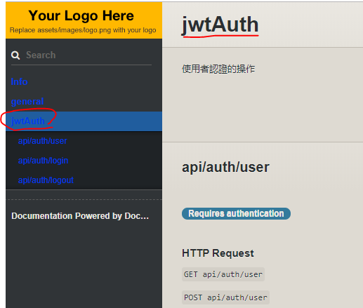
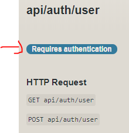
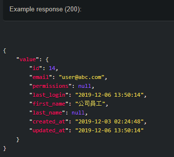

# apidoc安裝配置

[官方說明文件](https://laravel-apidoc-generator.readthedocs.io/en/latest/index.html)

## 安裝 composer 套件包

```text
composer require --dev mpociot/laravel-apidoc-generator
```

## 配置

### 發布指令: config 資料夾產生 apidoc.php

```text
php artisan vendor:publish --provider="Mpociot\ApiDoc\ApiDocGeneratorServiceProvider" --tag=apidoc-config
```

### 生成 API 文件

```text
php artisan apidoc:generate
```

* 文件位置 : [http://127.0.0.1/docs/index.html](http://127.0.0.1/docs/index.html)
* 預設 API 文檔模板，路徑 public/docs/source/index.md

```text
php artisan api:update
```

### 使用

```text
@group 分組 :將API對應的功能分群組
@bodyParam 必填參數 email String required 信箱 Example: abc@abc.com
@urlParam 描述參數 描述URL傳值參數名稱 例如: /api/user/{id} / {lang？}
@authenticated 指示身份驗證狀態
@response    回傳json格式
@responseFile 大型文件檔案 storage/responses
```

### 實作

* @group 側邊欄會顯示對應功能群

```php
/**
 *  @group jwtAuth
 *  使用者認證的操作
 */
class AuthController extends Controller
{
}
```



* @authenticated 生成的文檔中將“需要身份驗證”徽章添加到該路由
* @response Example response \(200\):會顯示範例格式

```php
/**
* @authenticated
* @response {
*    "value": {
*        "id": 14,
*        "email": "user@abc.com",
*        "permissions": null,
*        "last_login": "2019-12-06 13:50:14",
*        "first_name": "公司員工",
*        "last_name": null,
*        "created_at": "2019-12-03 02:24:48",
*        "updated_at": "2019-12-06 13:50:14"
*    }
* }
 */
```

 

