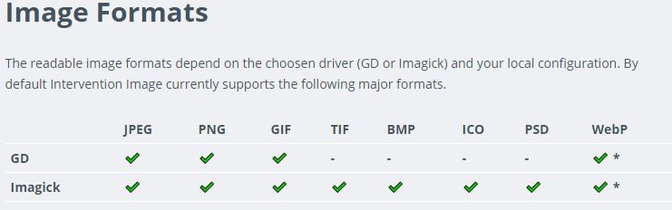

# Intervention/image安裝配置

[官方文件](http://image.intervention.io/getting_started/installation)

[範例:Laravel Intervention/image圖片處理擴充套件包的安裝、使用與可能遇到的坑詳解](https://codertw.com/%E7%A8%8B%E5%BC%8F%E8%AA%9E%E8%A8%80/202140/)

[範例:Intervention/image 圖片處理](https://learnku.com/laravel/t/1903/extension-recommended-interventionimage-image-processing)

## 安裝 composer 套件包

```bash
composer require intervention/image
```

## 配置

### **註冊服務提供者: 在config\app.php 添加**

```php
// 在 $providers，添加以下服務提供程序

'providers' => [
    Intervention\Image\ImageServiceProvider::class,
]
```

### 或是也可以增加一個別名: 在config\app.php  添加

```php
// 在 $aliases，添加
'aliases' => [
  'Image' => Intervention\Image\Facades\Image::class,
]
```

## 發布指令: config 資料夾產生 config/image.php

```bash
php artisan vendor:publish --provider="Intervention\Image\ImageServiceProviderLaravelRecent"
```

### 格式比較



## 記憶體設定

PHP中的圖像處理是一項非常消耗內存的任務。由於PHP中的大多數任務都不會耗盡默認的內存限制，因此必須確保配置能夠分配足夠的內存來處理大圖像。

php.ini 設定

* memory\_limit

  > 設置允許腳本分配的最大內存量（以字節為單位）。將3000 x 2000像素的圖像調整為300 x 200可能需要多達32MB的內存。

* upload\_max\_filesize

  > 如果您打算上傳大圖像，請驗證此最大文件上傳大小設置是否符合您的需求。

