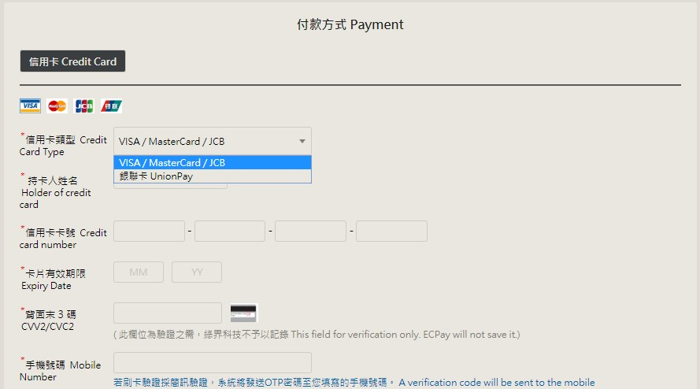
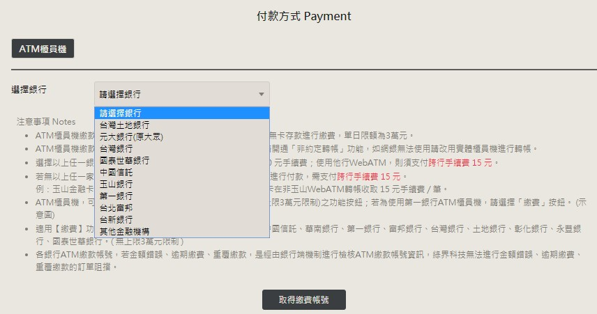
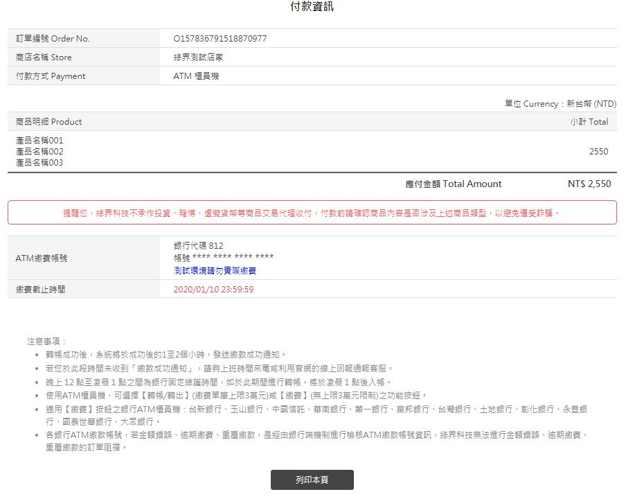
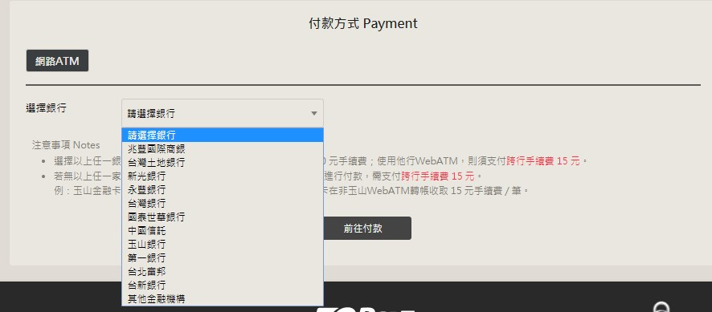
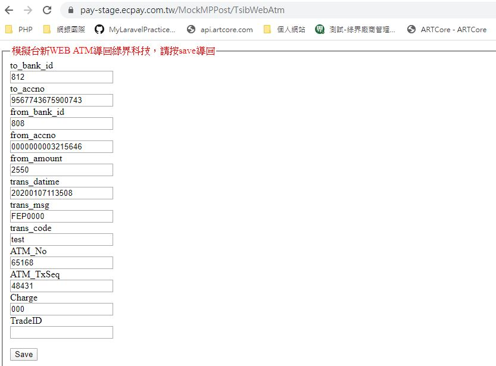
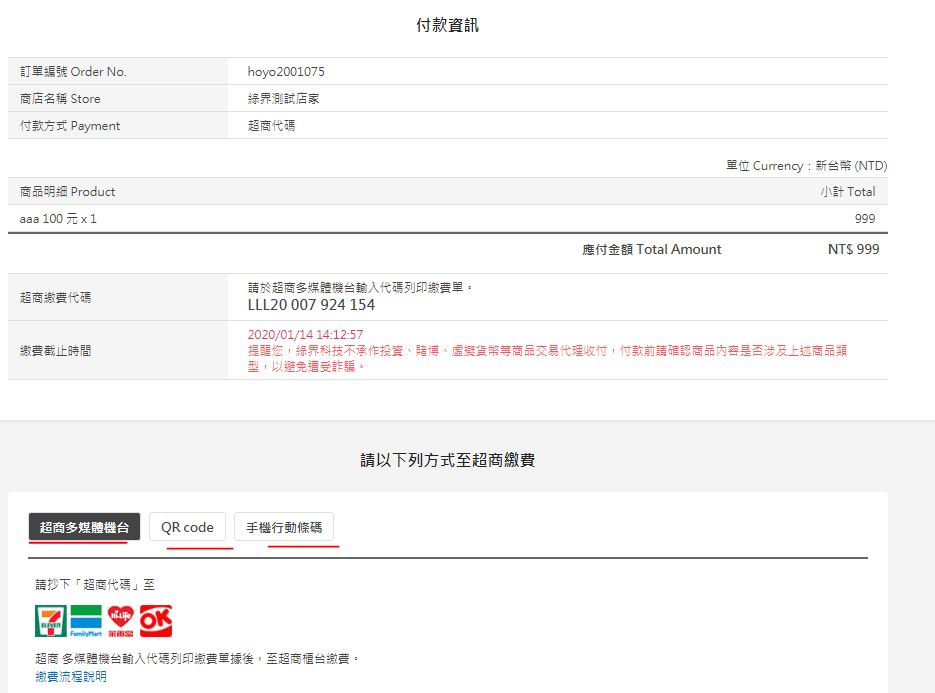
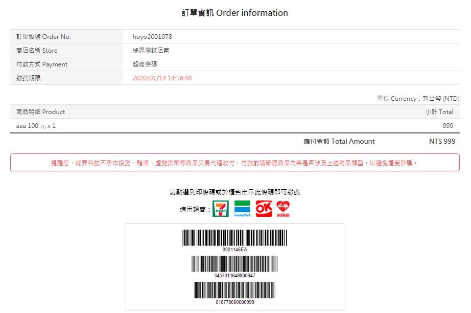
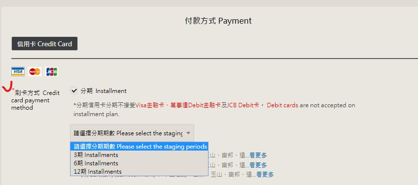

# 使用方法

[tsaiyihua/laravel-ecpay Github 說明](https://github.com/tsaiyihua/laravel-ecpay)

[綠界官方 ECPay/ECPayAIO_PHP](https://github.com/ECPay/ECPayAIO_PHP/tree/master/AioSDK)

[綠介廠商管理後台](https://vendor-stage.ecpay.com.tw/Frame/Index) 此網站可提供：

1. 查詢 ecpay 訂單，
2. 模擬付款並通知特店 若執行模擬付款功能，無法收到付款通知時，請留意此表後注意事項。

[laravel 原生php串接綠界](https://www.youtube.com/watch?v=YiovyOZ3v4s)

[其他測試綠界sdk](https://hoyo.idv.tw/?a=Tools/EcPay)

## 功能

### 傳送訂單資訊

> 傳送訂單資料:單筆時可簡單只傳送 ItemName 及 TotalAmount

Step 1.特店：將訂單資料以 POST(HTTP Method)傳送至綠界，準備進行付款。

Step 2.綠界：接受訂單並檢核資料。

> 測試上若出現503錯誤，可先清除瀏覽紀錄再重試

> 超商代碼也可從綠界後台產生

```php
public function __construct(Checkout $checkout)
{
   $this->checkout = $checkout;
}

public function sendOrder()
{

$formData = [
    'UserId' => 1, // 用戶ID , Optional
    'ItemDescription' => '產品簡介',
    'ItemName' => 'Product Name', //*必填 一行一行顯示商品名稱的話，以符號 # 隔開
    'TotalAmount' => '2550',  // *單筆必填 ,金額必須是整數 不可帶入小數點與千分位,否則判斷格式錯誤
    'PaymentMethod' => 'Credit',  // ALL, Credit, ATM, WebATM,CVS, BRCODE 影響綠界回傳付款頁面
];

return $this->checkout->setPostData($formData)->send();
}
```















### 分期付款 withInstallment(分期期數)

- 信用卡分期可用參數為:3,6,12,18,24 ex： 3,6 範例

```php
return $this->checkout->setPostData($formData)->withInstallment('3,6')->send();
```



### 定期定額扣款 withPeriodAmount(\$periodAmt)

```php
// 每 2 個月扣 1 次 ，成功扣款 5 次後結束。每次扣款金額:2,550元(新台幣/NTD)
$periodAmt = [
    'PeriodAmount' => 2,550, // PeriodAmount與TotalAmount 須一致
    'PeriodType' => 'M',  // 何時扣 Y、M、D
    'Frequency' => '2',  // 多久一次
    'ExecTimes' => 5,   // 共扣幾次
    'PeriodReturnURL'
];

return $this->checkout->setPostData($formData)->withPeriodAmount($periodAmt)->send();
```

### 查詢訂單 withPeriodAmount(\$periodAmt)

```php
use TsaiYiHua\ECPay\QueryTradeInfo;

public function __construct(QueryTradeInfo $queryTradeInfo)
{
    $this->queryTradeInfo = $queryTradeInfo;
}

public function queryInfo()
{
    $orderId = 'MerchantTradeNo';
    return $this->queryTradeInfo->getData($orderId)->query();
}

```

### 需要開立發票時 加上 withInvoice(\$invData) 即可。

```php
public function sendOrderWithInvoice()
{
    // 範例
    $items[0] = [
        'name' => '產品A',
        'qty' => '1',
        'unit' => '個',
        'price' => '150'
    ];
    $formData = [
        'ItemName'=>'產品A',
        'TotalAmount' => '150',
        'ItemDescription' => '產品簡介',
        'Items' => $items,
        'PaymentMethod' => 'Credit',
        'UserId' => 123,
    ];
    $invData = [
        'Items' => $items,
        'UserId' => 123,
        'CustomerName' => 'User Name',
        'CustomerAddr' => 'ABC 123',
        'CustomerEmail' => 'email@address.com', // 須符合信箱格式
        'CustomerPhone'=>'0900123456',
    ];
    return $this->checkout->setPostData($formData)->withInvoice($invData)->send();
```

### 查詢發票

```php
use TsaiYiHua\ECPay\QueryInvoice;

    public function __construct(QueryInvoice $queryInvoice)
    {
        $this->queryInvoice = $queryInvoice;
    }

    public function queryInvInfo()
    {
        $orderId = 'O157829651197277433';
        return $this->queryInvoice->getData($orderId)->query();
    }
```

## 綠界測試後台功能
* 查詢交易紀錄
* 切換電子發票系統:查詢電子發票
* 系統開發管理: 
	* 例如查詢交易代碼 1200025、1200031
	* 模擬交易 (測試)

## 實作

- 複製 tsaiyihua/laravel-ecpay 套件包到專案目錄底下
- 新建 ECPayController 設定功能
- 配置路由
- 後續測試參數可透過 view post 傳入

```php
// --測試綠界 傳送訂單資訊
Route::get('/order/send', 'Backend\ECPayController@sendOrder');
```

```php
<?php
namespace App\Http\Controllers\Backend;

use Illuminate\Http\Request;
use TsaiYiHua\ECPay\Checkout;
use TsaiYiHua\ECPay\QueryInvoice;
use TsaiYiHua\ECPay\QueryTradeInfo;
use App\Http\Controllers\Controller;

class ECPayController extends Controller
{
    public function __construct(Checkout $checkout, QueryTradeInfo $queryTradeInfo, QueryInvoice $queryInvoice)
    {
        $this->checkout = $checkout;
        $this->queryTradeInfo = $queryTradeInfo; // 查詢訂單
        $this->queryInvoice = $queryInvoice;
    }

    public function index()
    {
        return view('backend.order.index');
    }

    public function sendOrder(Request $request)
    {

        $formData = [
            'UserId' => 123,
            'ItemDescription' => '產品描述',
            'ItemName' => '產品名稱001#產品名稱002#產品名稱003',
            'TotalAmount' => '2550',
            'PaymentMethod' => 'ATM',
        ];
        return $this->checkout->setPostData($formData)->send();

        /**
         * 信用卡 刷卡方式 Credit:分期付款、定期定額扣款
         */

        // 分期付款 withInstallment () 可以提供分期選項 ex:3,6,12
        // return $this->checkout->setPostData($formData)->withInstallment('3,6,12')->send();

        // 定期定額扣款 withPeriodAmount($periodAmt)
        // 每 2 個月扣 1 次 ，成功扣款 5 次後結束。每次扣款金額:2,550元(新台幣/NTD)
        $periodAmt = [
            'PeriodAmount' => 2550, // PeriodAmount與TotalAmount 須一致
            'PeriodType' => 'M',  // 何時扣 Y、M、D
            'Frequency' => '2',  // 多久一次
            'ExecTimes' => 5,   // 共扣幾次
            'PeriodReturnURL'
        ];
        // return $this->checkout->setPostData($formData)->withPeriodAmount($periodAmt)->send();
    }

    /**
     * 查詢訂單 回傳json格式
     * @orderId : 訂單編號 MerchantTradeNo
     */
    public function queryInfo()
    {
        // $orderId = 'O157828168559436459';   // 101元
        // $orderId = 'O157827716678311645';  // 2550 元
        // $orderId = 'hoyo2020002';  // 999 元 用其他api產生
        $orderId = 'O157829651197144734';  // 150 元 + 發票
        return $this->queryTradeInfo->getData($orderId)->query();
    }

    /**
     * 需要開立發票時 withInvoice()
     */
    public function sendOrderWithInvoice()
    {
        // 範例
        $items[0] = [
            'name' => '產品A',
            'qty' => '1',
            'unit' => '個',
            'price' => '150'
        ];
        $formData = [
            'ItemName'=>'產品A',
            'TotalAmount' => '150',
            'ItemDescription' => '產品簡介',
            'Items' => $items,
            'PaymentMethod' => 'Credit',
            'UserId' => 123,
        ];
        $invData = [
            'Items' => $items,
            'UserId' => 123,
            'CustomerName' => 'User Name',
            'CustomerAddr' => 'ABC 123',
            'CustomerEmail' => 'email@address.com',
            'CustomerPhone'=>'0900123456',
        ];
        return $this->checkout->setPostData($formData)->withInvoice($invData)->send();
    }

    /**
     * 查詢發票
     * @orderId : 訂單編號 MerchantTradeNo
     */
    public function queryInvInfo()
    {
        $orderId = 'O157829651197277433';
        return $this->queryInvoice->getData($orderId)->query();
    }
}
```
