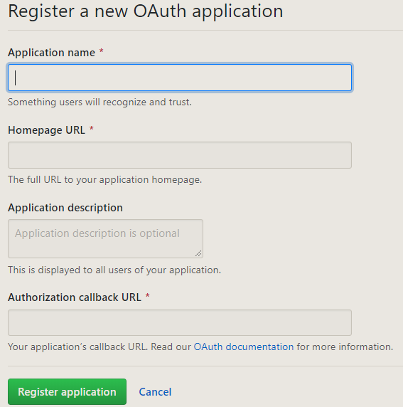

# laravel/socialite安裝配置

[學院君-第三方登录解决方案](https://xueyuanjun.com/post/19991)

[範例\(搭配User表比對\)](https://9iphp.com/web/laravel/laravel-social-authentication-with-github.html)

## 安裝 composer 套件包

```bash
composer require laravel/socialite
```

## 申請第三方OAuth

* [gitHub](https://github.com/settings/developers)

    
    
* [facebook](https://developers.facebook.com/)
  * 登入fb帳號後=&gt;建立應用程式
  * 設定=&gt;基本資料=&gt;取得client\_id、client\_secret
  * 產品=&gt;快速入門=&gt;選擇網站=&gt;設定網址
    * [google](https://console.developers.google.com/)

      > [申請教學](https://w3path.com/laravel-6-google-login-tutorial-with-live-demo/)

## 配置文件: config/services.php 、 .env檔案

* 配置client\_id、client\_secret、redirect

  ```text
  'github' => [
   'client_id' => env('GITHUB_CLIENT_ID'),         // Your GitHub Client ID
   'client_secret' => env('GITHUB_CLIENT_SECRET'), // Your GitHub Client Secret
   'redirect' => 'http://your-callback-url',  // http://your-callback-url
  ],
  ```

## 配置 LoginCroller控制器

* 重定向用戶到OAuth提供者

  ```php
  public function redirrectProvder()
   {
       return Socialite::driver('github')->redirect();
   }
  ```

* 認證後獲取來自提供者的回調

  ```php
  public function handleProviderCallback($provider)
  {
   try {
       $user = Socialite::driver($provider)->user();
       $authUser = $this->findOrCreateUser($user, $provider);
       Auth::login($authUser);
       return redirect($this->redirectTo);
   } catch (Exception $e) {
       return redirect('login');
   }
  }
  // 後續客戶端認證處理
  protected function findOrCreateUser($user, $provider)
   {
       $oauthProvider = OAuthProvider::where('provider', $provider)
           ->where('provider_id', $user->getId())
           ->first();

       if ($oauthProvider) {
           $oauthProvider->update([
               'token' => $user->token,
               'refresh_token' => $user->refreshToken,
           ]);

           return $oauthProvider->user;
       } else {
           return $this->createUser($provider, $user);
       }
   }

   protected function createUser($provider, $user)
   {

       $newUser = User::where('email', $user->getEmail())->first();

       if (! $newUser) {
           $newUser = User::create([
               'email' => $user->getEmail(),
               'password' => '',
           ]);
       }

       $newUser->oauthProviders()->create([
           'provider' => $provider,
           'provider_id' => $user->getId(),
           'token' => $user->token,
           'refresh_token' => $user->refreshToken,
       ]);

       return $newUser;
   }
  ```

## 配置路由

```php
Route::group(['prefix' => 'login', 'namespace' => 'Auth'], function ($provider) {
    Route::get('/{provider}', 'LoginController@redirrectProvder');
    Route::get('{provider}/callback', 'LoginController@handleProviderCallback');
});
```

## 配置視圖

```markup
<a href="{{ url('/login/facebook') }}" class="btn btn-primary">facebook</a>
```

## cURL error 60 錯誤: 無法獲得本地端憑證

> 錯誤訊息: cURL error 60:SSL certificate problem: unable to get local issuer certificate

[libcurl error codes](https://curl.haxx.se/libcurl/c/libcurl-errors.html)

cURL利用URL語法在命令行下工作的檔案傳輸工具 它支援檔案上傳和下載，是綜合傳輸工具，還包含了用於程式開發的libcurl

> 解決方式 1. 下載憑證 cacert.pem 2. 放置至 phpStudy\PHPTutorial\php\php-7.2.1-nts\extras\ssl 資料夾 3. 修改php.ini文件 \[curl\] 的 curl.cainfo ="憑證絕對路徑" \(預設 ;curl.cainfo = \)

