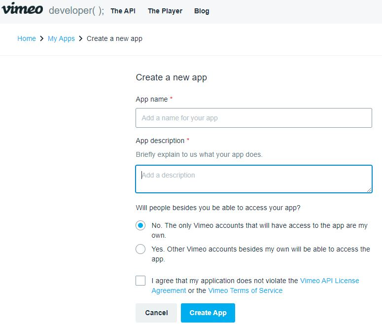

# vimeo/laravel安裝配置

[Github文件](https://github.com/vimeo/laravel)

[\[API\] Vimeo API 使用筆記](https://pjchender.github.io/2018/05/30/api-vimeo-api-%E4%BD%BF%E7%94%A8%E7%AD%86%E8%A8%98/)

## 安裝 composer 套件包

```bash
composer require vimeo/laravel
```

## 配置

### **註冊服務提供者: 在config\app.php 添加**

```php
// 在 $providers，添加以下服務提供程序

'providers' => [
    Vimeo\Laravel\VimeoServiceProvider::class,
]
```

### 或是也可以增加一個別名: 在config\app.php  添加

```php
// 在 $aliases，添加
'aliases' => [
    'Vimeo' => Vimeo\Laravel\Facades\Vimeo::class
]
```

## 發布指令: config 資料夾產生 config/vimeo.php

```bash
php artisan vendor:publish --provider="Vimeo\Laravel\VimeoServiceProvider"
```

## 安裝 vimeo/vimeo-api 套件包

```bash
composer require vimeo/vimeo-api
```

## 申請API

[申請Vimeo API](https://developer.vimeo.com/)

> 取得 client\_id、client\_id、client\_secret、access\_token



## config/vimeo.php 取得環境配置 .env

* VIMEO\_CLIENT=
* VIMEO\_SECRET=
* VIMEO\_ACCESS=

