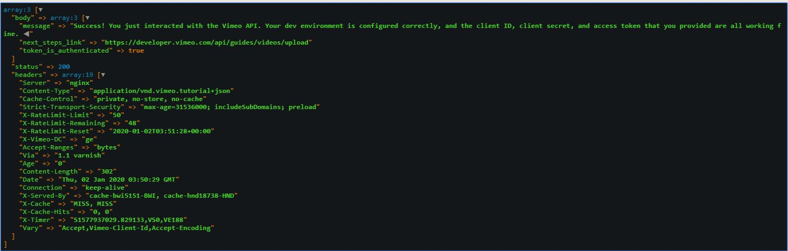
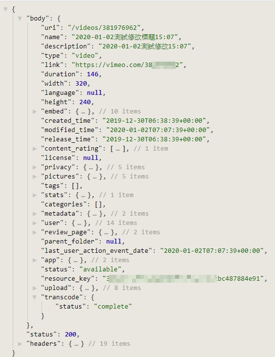

# vimeo/vimeo-api使用說明

[官方API說明](https://developer.vimeo.com/api/guides/start)

## 測試是否配置成功\(client\_id, client\_secret, access\_token\)



```php
return Vimeo::request('/tutorial', array(), 'GET');
```

## 取得影片

```php
// 寫法1
use Vimeo\Vimeo;

$client_id = 'your client_id';
$client_secret = 'your client_secret';
$access_token = 'your access_token';

$client = new Vimeo($client_id, $client_secret, $access_token);
$uri = '/videos/{video_id}';
return $client->request($uri, array(), 'GET');
```

```php
// 寫法2
use Vimeo\Laravel\Facades\Vimeo;
$uri = '/videos/{video_id}';
return Vimeo::request($uri, array(), 'GET');
```

### 回傳格式



* body : 影片資訊

  * uri
  * name
  * description
  * type
  * privacy 隱私
  * pictures 縮圖
  * Transcode status

  略......

* status : http 狀態碼
* headers : 回應標頭資訊

### 過濾影片資訊

```php
// fields:指定 body 返回哪些資料, ex: link,uri,name,transcode.status
return Vimeo::request($uri.'?fields=link,uri,name,transcode.status'); 


// 可用來判斷轉碼狀態transcode.status
$response = Vimeo::request($uri . '?fields=transcode.status');
if ($response['body']['transcode']['status'] === 'complete') {

} elseif ($response['body']['transcode']['status'] === 'in_progress') {

} else {

}
```

### [通用參數](https://developer.vimeo.com/api/common-formats)

* [fields](https://developer.vimeo.com/api/common-formats#json-filter) : 指定要返回哪些字段
* sort 和 direction : 排序
* filter : 例如:過濾視頻
* page 和 per\_page : 分頁
* sizes : 圖像尺寸

## 編輯影片標題和描述

```php
return Vimeo::request($uri, array(
    'name' => date('Y-m-d').'測試修改標題'.date('H:i'),
    'description' => date('Y-m-d').'測試修改'.date('H:i'),
    ), 'PATCH');
```

## 上傳影片 upload\(\)

### 步驟

1. 申請API
2. 準備影片
3. 將影片上傳帳戶
4. 上傳權限， ps:修改不需要上傳權限
   * 需要先申請啟用上傳權限
   * 無權限: Unable to initiate an upload. \[Your access token does not have the "upload" scope\]

```php
return Vimeo::upload($uri, array(
    "name" => "影片名稱",
    "description" => "描述"
    ));
```

